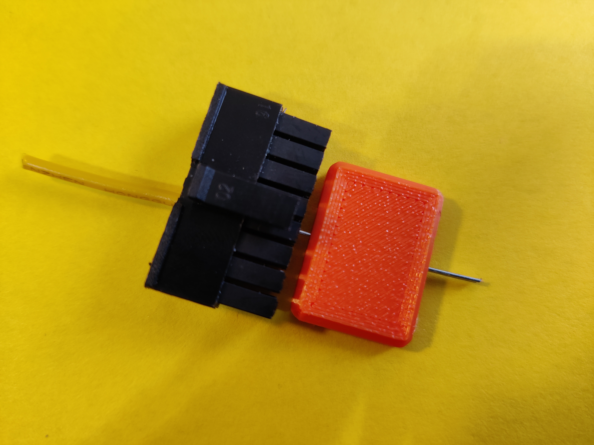
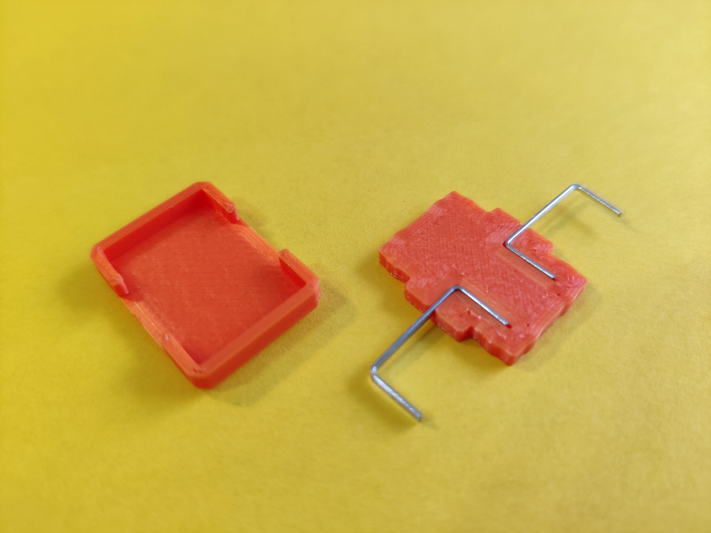
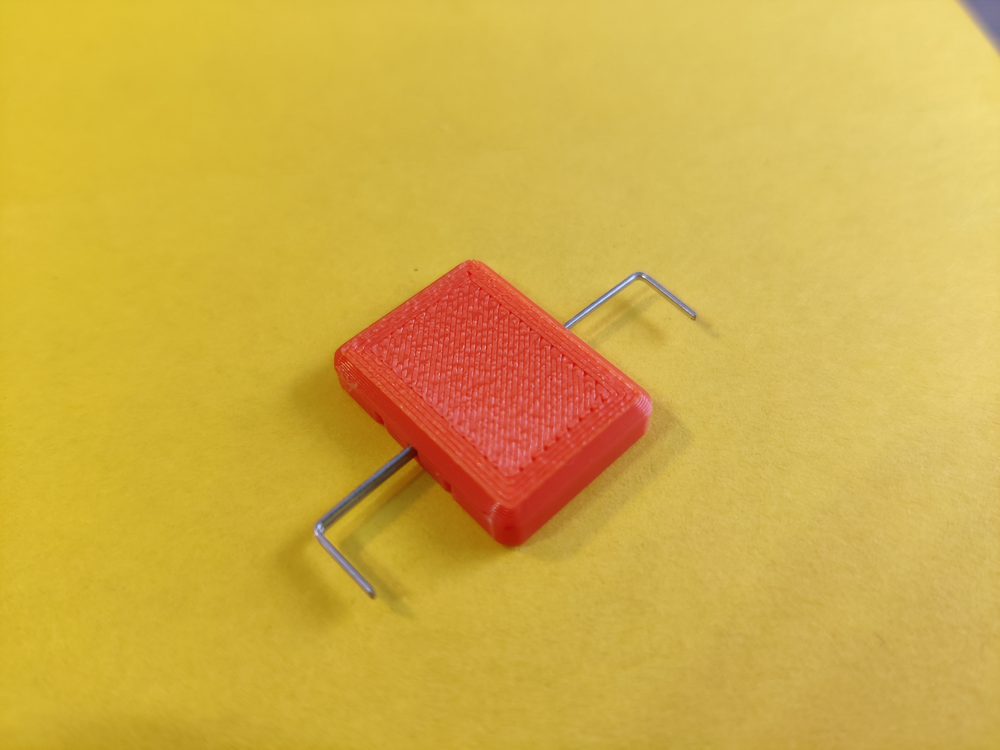
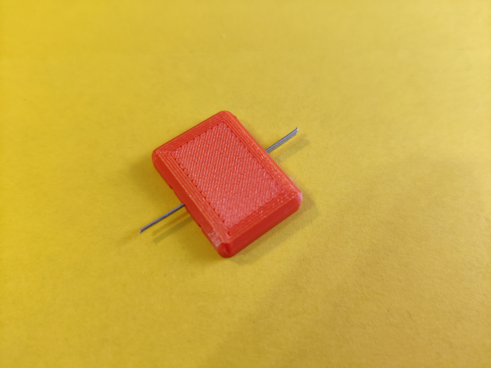

# Molex Microfit 3.0 Extractor using Staplers (DIN 24/6)

A cheap and simple way to remove receptable terminals from a molex microfit 3.0 pin. Usually, you need a <a href="https://www.molex.com/molex/products/part-detail/application_toolin/0011030043">special tool from Molex</a>, but a stapler does the job just fine. One side takes two staplers (DIN 24/6), one takes a single one. The single-stapler side works fine for me.
<h4>Printing</h4>
Printed in PLA with 0.12mm layer height and 3 walls. The staplers should fit quite snug, and the cap should press-fit with little resistance so it can be taken apart again.
<h4>Assembly</h4><ol><li>Place one stapler in the narrow path, and two (best if they're still connected) staplers in the deeper path.</li><li>Press-fit the cap on top.</li><li>Use pliers to cut off the legs flush on the corner</li></ol><h4>Usage</h4><ol><li>Push the wire deeper into the connector so the wings of the receptable aren't pressed against the plastic</li><li>Push the tool into the pin on <strong>either side</strong> of the pin, but between the plastic and the connector. If cut correctly, the stapler should fit into the pin with only 1mm of play</li><li>Wiggle the tool around to collapse the wing, sometimes rotating the tool helps too</li><li>Repeat the process on the other side too.</li><li>Pull out the wire 🎉</li></ol>

