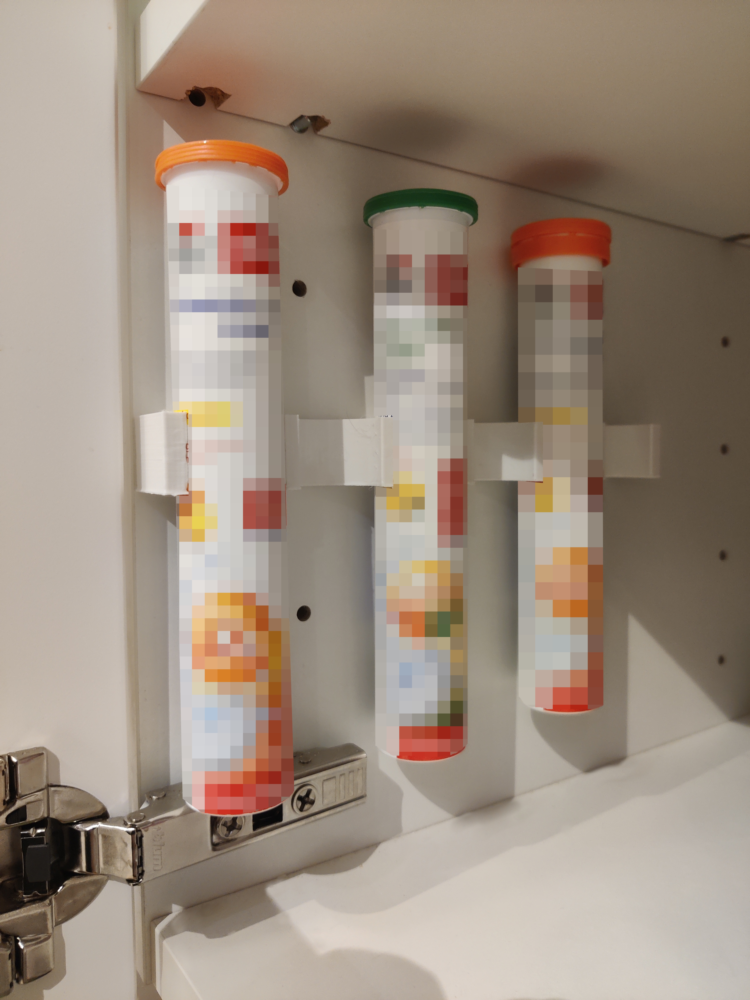

# METOD VITAMIN tube holder

<h3>Properties</h3><ul><li>Hole diameter: 5mm</li><li>Distance between both holes: 32mm</li><li>Distance from edge to first hole: 17mm</li><li>Opening angle for a tube holder: 130°</li><li>Tube diameter: 28.8mm</li><li>Max tube cap diameter 35mm (with 1.75mm space between)</li></ul><h3>Printing</h3>
The pins need minimal support, depending on your layer height, you might also need to remove some excess on the pins.

