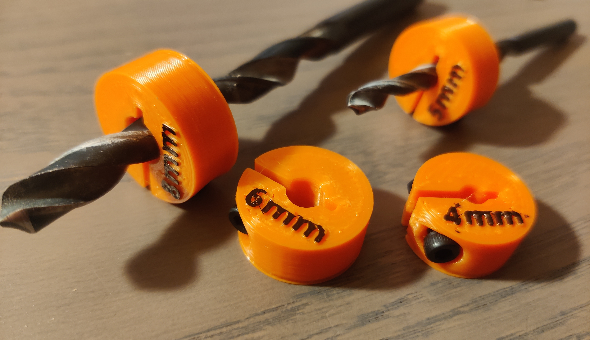

# Drilling Depth Stop using DIN912 M3x10

<h3>Print Settings</h3><ul><li>Layer Height: 0.2</li></ul><h3>Flat Top vs. Angled Top</h3>
The flat top version has nicer lettering and is more neat, but one might prefer an angled top to avoid damaging wallpaper.

