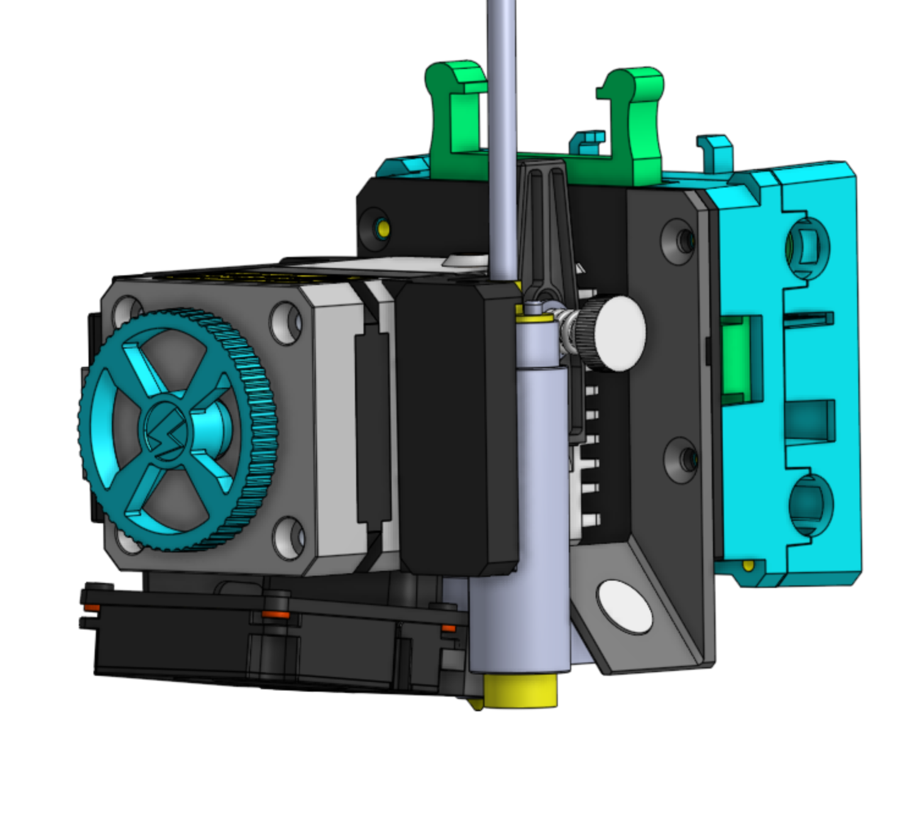
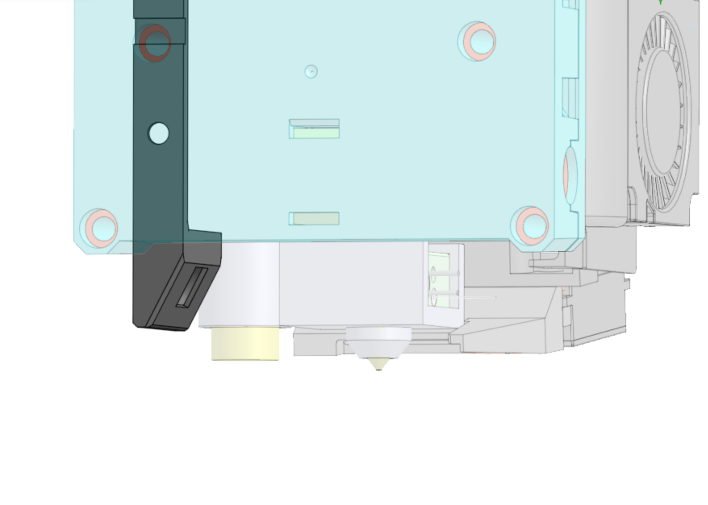
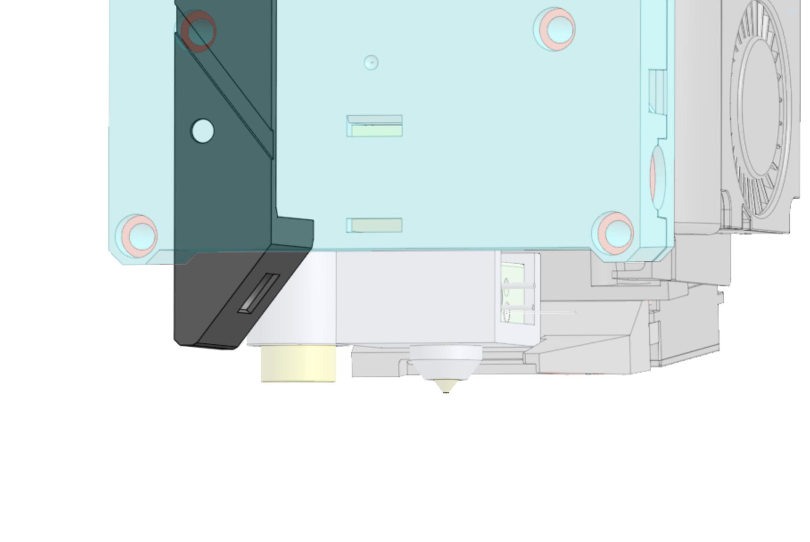

# Sovol SV06 Gantry WS2812B LED Mount

Gantry mount that adds a WS2812B LED to the gantry of the Sovol SV06 using the screws used to mount the hotend to the gantry.
<h3>Printing</h3>
Layer height should be fine (≤ 0.2mm) to properly trap the LED, but otherwise prints fine with a 0.6mm nozzle. Black PLA hides the mount quite well.
<h3>Assembly</h3>
Glue the LED onto the cutout and feed the wires through the tunnel. Remove the screws (careful, they are 2 of 3 screws holding the hotend plate), add the LED mount and if possible, replace with longer screws (M3x10 countersunk worked for me, the hole with the fitting should be ~11mm deep)
<h3>Wiring</h3>
The JST GH 1.25mm connector on that side should be wired as follows (top-to-bottom): 5V, Ground, PA4 (no guarantees!).&nbsp;
<h4>Example Klipper Configuration:</h4><pre><code class="language-plaintext">[neopixel hotend_neopixel]
pin: PA4
chain_count: 1
color_order: GRB</code></pre>
&nbsp;

I've added a tunnel version if you'd like to hide the cable to the pin even more, I'm happy with the simple version (full disclosure: I haven't tried the tunnel version).

