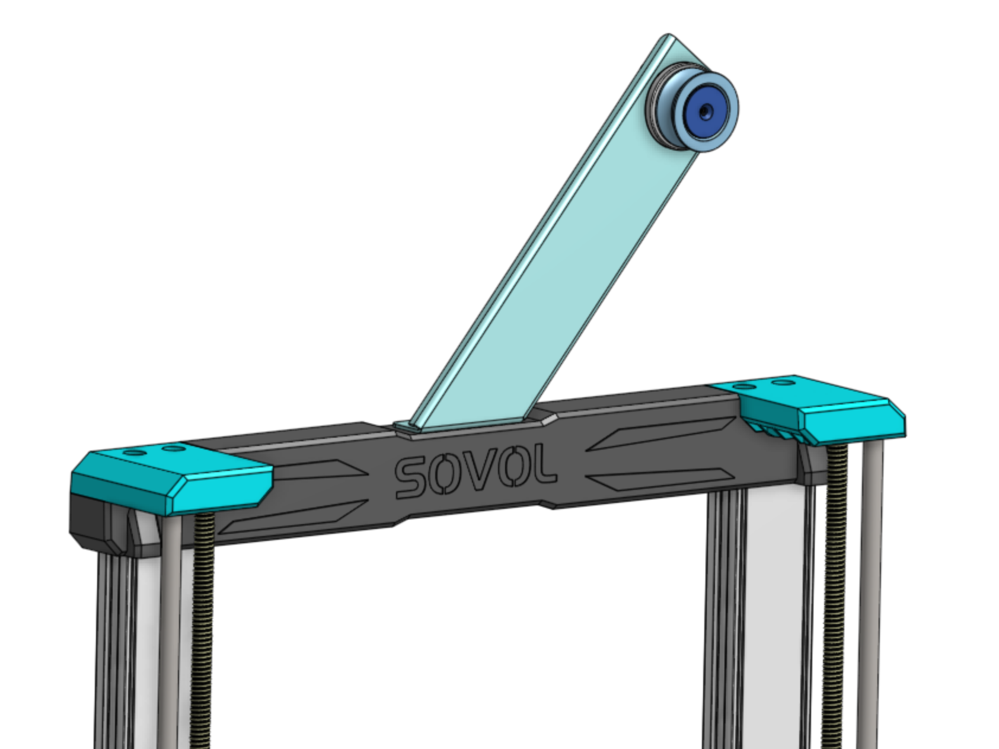
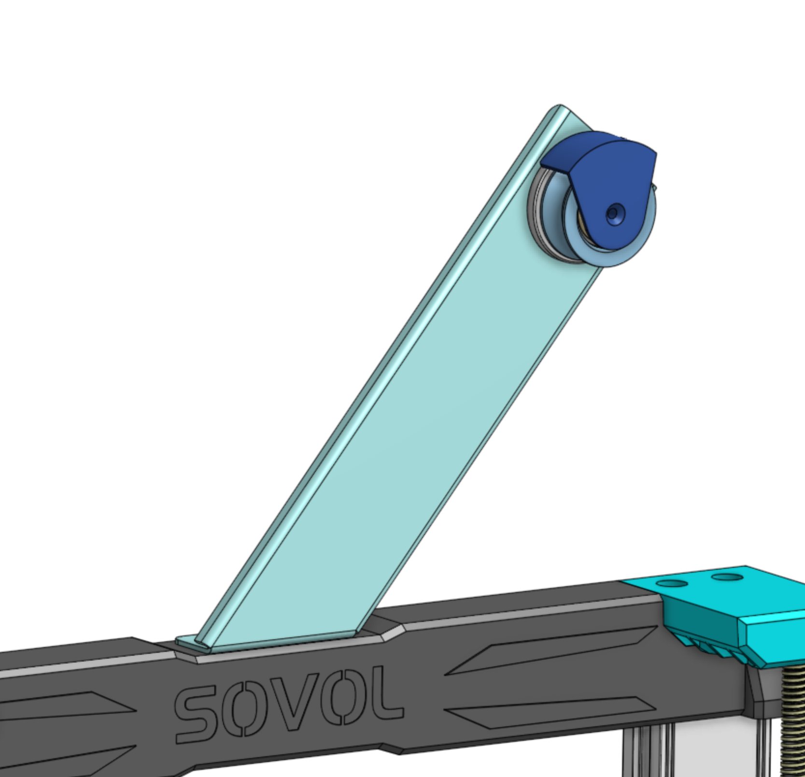

# Sovol SV06 Filament Guide Wheel with Ball Bearing

I don't use the filament holder as I have all my filament in dryboxes next to the printer, so I used to only use it to guide the filament. When printing fast enough, the filament grinding on the spoolholder made a distressing noise, so I came up with this simple wheel that guides the filament.

Thanks to Sovol releasing all the Step files, it was as simple as modifying the filament holder, keeping the locking mechanism and just adding a wheel.
<h3>Extra parts</h3><ul><li>M3x12 countersunk screw</li><li>608 ball bearing</li></ul><h3>Printing</h3><ul><li>Choose either the simple &nbsp;cap or the cap with shield. With the simple cap, you just throw the filament on there, but long retractions might cause the filament to fall off the wheel.&nbsp;</li><li>≤ 0.2mm Layer Height (especially the thread for the barrell and the wheel will benefit from smaller layers)</li><li>Support: Yes for the locking barrel (use a higher XY distance (~0.5mm) so it's easy to remove)</li><li>Slicing Tolerance: Exclusive (the dimensions for the 608 ball bearing are a tight fit, and the barrel is taken directly from sovol)</li></ul><h3>Assembly</h3><ol><li>Press the ball bearing into the wheel (only fits from one side)</li><li>Mount the wheel onto the barrel</li><li>Add the cap you chose and screw tight with the M3 screw</li><li>Unmount the original filament holder (keep the locking piece)</li><li>Mount the new wheel</li></ol>

