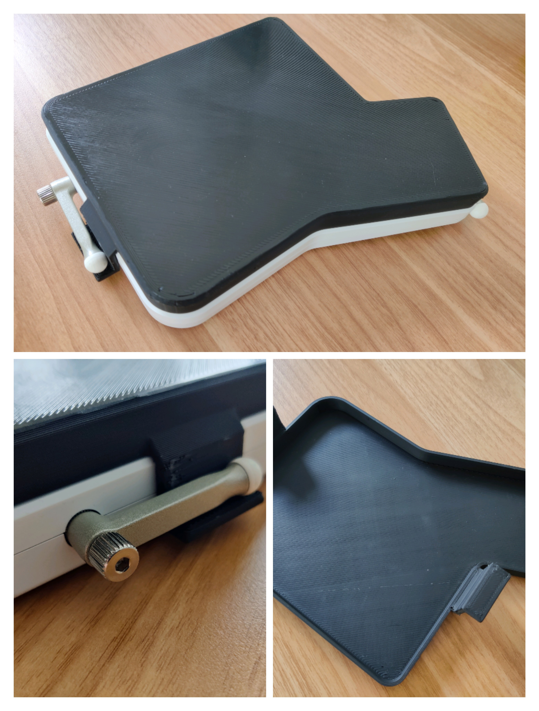

# Ergodox EZ Protective Travel Case

This case protects your keys when traveling and is easily attached and removed using the legs of the keyboard to lock it in place. It is based on the original dimensions and sits flush on the top surface of the keyboard. The latches lock the keyboard halves together.

Thank you ZSA for providing the dimensions for the original ergodox ez case.&nbsp;
<h3>Printing</h3><ul><li>3x Latch (for fastening the keyboard halves together)</li><li>2x Top Case (once mirrored), flipped with the top being the first layer</li><li>Avoid a brim, use tabs on the edges to avoid warping (the brim might impact the chamfer-fillets)</li><li>0.3mm layer height is fine, smaller layer heights will make the chamfer-fillets look better</li><li>Regular supports with a high density support roof will create a decent finish on the hinges</li><li>Top/Bottom Layers: 9999+ so the hinges and the plate are printed as solids (both is important)</li></ul>
The most tedious aspect of this is getting a good first layer for this on a smooth PEI sheet. Any imperfection or oozing, any gluestick will show up on the top, especially with dark filaments. I raised the bed temperature for the first layers (PLA, 80°C), not sure if that helped or made it more difficult honestly.
<h3>Assembly</h3><ul><li>Rotate the feet upwards</li><li>Put the case on top</li><li>Rotate the feet onto the hinges to fasten the case</li><li>Screw the feet into place</li><li>Stack the keyboard halves and use the latches to fix them in place</li></ul>

