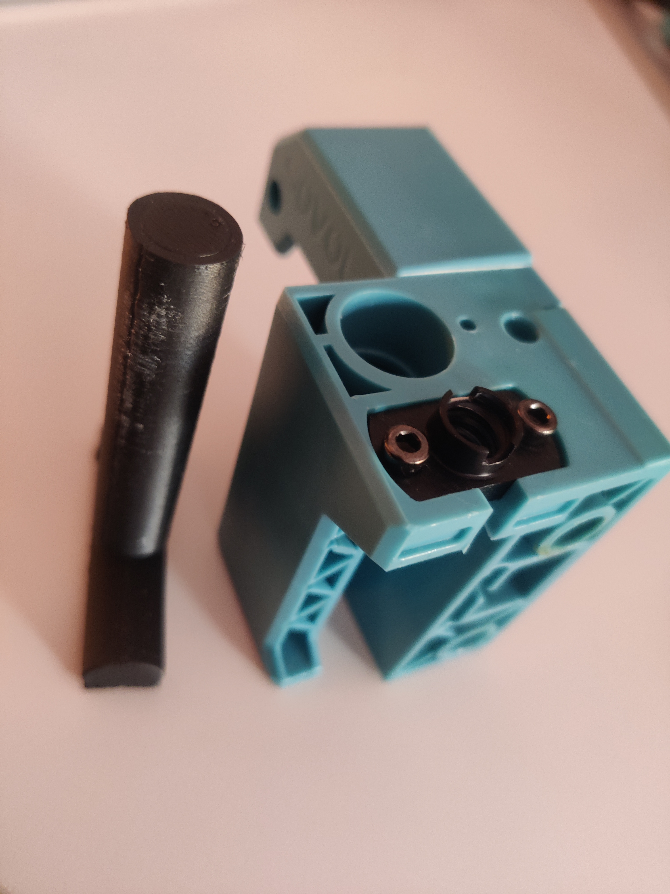

# LM8UU Bearing Removal Tool for Sovol SV06 (longer: 65mm)

Remix of the excellent tool by <a href="https://www.printables.com/social/150586-aldabest/">@aldabest</a> with a longer rod so it can remove both bearings on the Y-axis mounts on the Sovol SV06.
<h3>Print Settings</h3><ul><li>Layer height 0.2mm</li><li>Sturdier settings, e.g. 1.2mm walls and stronger top/bottoms, 20% infill</li></ul><h3>Usage (see <a href="https://www.reddit.com/r/Sovol/comments/129zwxa/sovol_sv06_z_axis_bearings_removal/">this video</a>)</h3><ul><li>Remove the screws and washers on the bottom first</li><li>Align the tool on the top so it touches the top bearing</li><li>Hit it with a hammer until the bearings pop out on the bottom (there are two per side)</li></ul>

