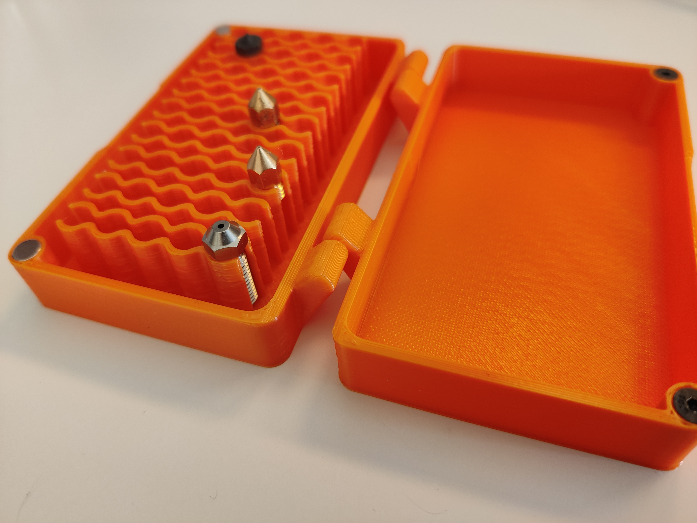
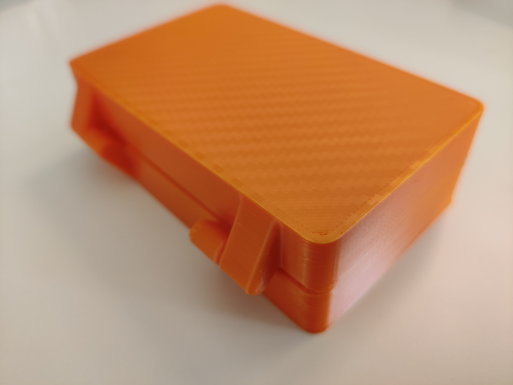
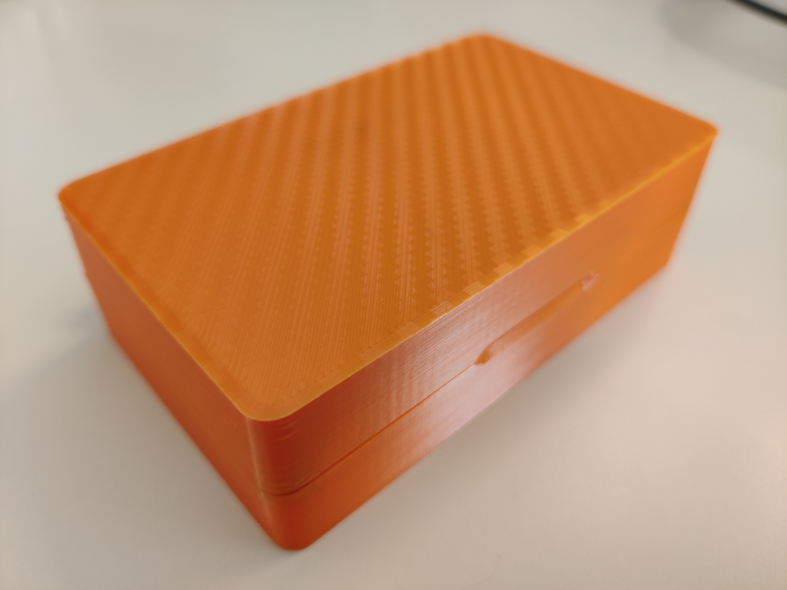

# Plain Nozzle Box (print-in-place, MK8/V6/Volcano)

This is a remix of the original nozzlebox with options that fit Volcano and MK8 nozzles. Like the original, it prints in place and is locked by a magnet (6x2mm!) and an M3x6 (or smaller) screw. It doesn't come with any markings so that one can just add a sheet of paper (of which I attached a paper with the exact dimensions for a print-out)

The contraption is printed at an angle so that even dirty nozzles should fit – the bottom of the contraption is ~7mm apart while the top is ~6mm.

Thank you very much <a href="https://www.printables.com/@dodasch">@dodasch</a> for the original. It's been a very interesting journey trying to recreate this neat design.

<a href="https://cad.onshape.com/documents/bf0cc075118fec4e3f5c0deb/w/1c500c8e0093206480606556/e/c03a317ed7b7921c13df6426">The Onshape Document contains both versions</a>, the box parameters can be changed easily, the tolerances and angles will probably be a bit trickier.
<h3>Printing</h3><ul><li>0.2mm layer height</li><li>Well tuned flow (maybe lessen the outer-wall flow) so the hinge and the ball print properly</li></ul><h3>Assembly</h3><ul><li>Press the 6x2mm magnets into the holes on the bottom part</li><li>Screw the M3x6mm countersunk screws into the base of the top part</li></ul><h3>Warning</h3><ul><li>I didn't print the standard version, but reduced the height of the contraption and the box compared to the volcano box.</li><li>I didn't have 5x2mm magnets, so this version uses <strong>6x2mm</strong> magnets. I can provide a 5x2mm version if there's demand for that.</li></ul>

