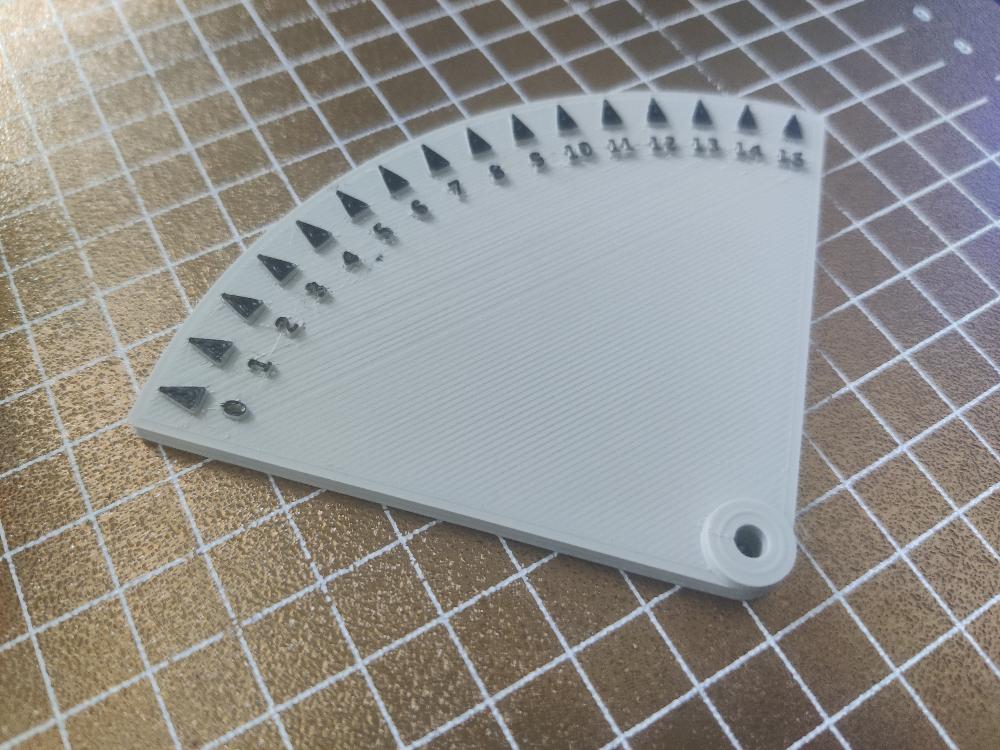

# Screw Turn Gauge for Screws Tilt Calculate (Klipper)

Klipper's <code>SCREWS_TILT_CALCULATE</code> shows minutes to turn the screws. This gauge has a quarter hour on it and the hole has space for the allen-key to freely rotate.

