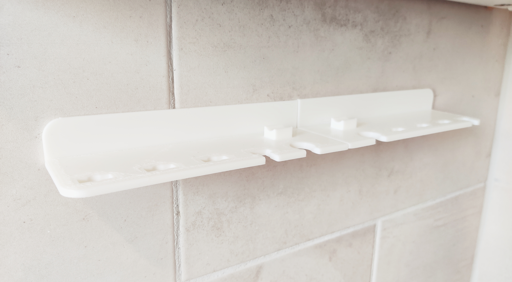
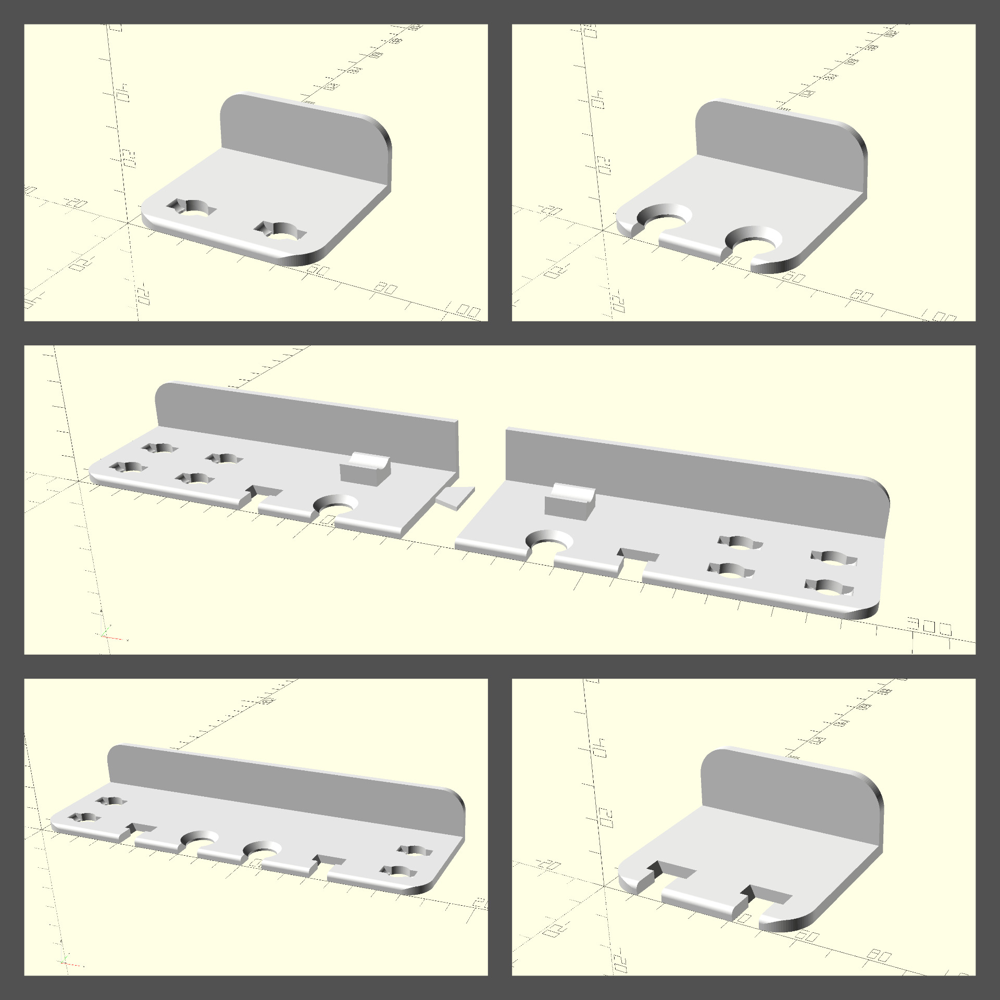

# Modular Bathroom Shelf (OpenSCAD)

This bathroom shelf comes in a few simple configurations for a two-person household, but you can also generate your own to accommodate any number of toothbrush heads, interdental brushes, lash combs etc. using the massively overengineered and amateurish OpenSCAD script I provided.

If the design is too large, you can split it up in two or more pieces connected by a joint.
<h4>Print Settings</h4>
No special print settings necessary, I tried keeping the layer height not too high (~0.24mm) so that the fillets look and feel nice, but it worked out quite alright with a .6mm nozzle.
<h4>Script Remarks</h4>
The most relevant part of the scripts are the configuration variables at the top and whatever you specify to go in the <code>render_modules([…])</code> call. You should be able to adjust the variables slightly to your needs, but some values in the modules are hardcoded and won't scale well with different values (e.g. like <code>depth</code>).

<code>render_modules</code> is clever in the worst way possible:
<ul><li>The only parameter is <strong>a list </strong>of either:<ul><li><strong>A string</strong> for the module you want to render</li><li><strong>A list of strings</strong> for multiple modules that should be rendered atop each other (e.g. <code>render_modules([ ["philips_sonicare", "tepe_interdental_short_back"] ]);</code> will render a sonicare holder and behind that a tepe_interdental holder</li><li><strong>A list of list of strings</strong> for a module that should be aligned in a special way, e.g. <code>render_modules([ ["philips_sonicare", ["connector_left", "right"] ]);</code> will render a philips_sonicare holder, and a right aligned connector for the left side of a two-object print</li></ul></li></ul>
To get a model that can be printed as two pieces, insert connectors and between them add a <code>empty_long</code> , which will render a 20mm blank space between the connectors, e.g.
<pre><code class="language-plaintext">render_modules([ 
  "philips_sonicare", 
  [["connector_left", "right"]],
  "empty_long",
  [["connector_right", "left"]],
  "philips_sonicare",
]);</code></pre>

