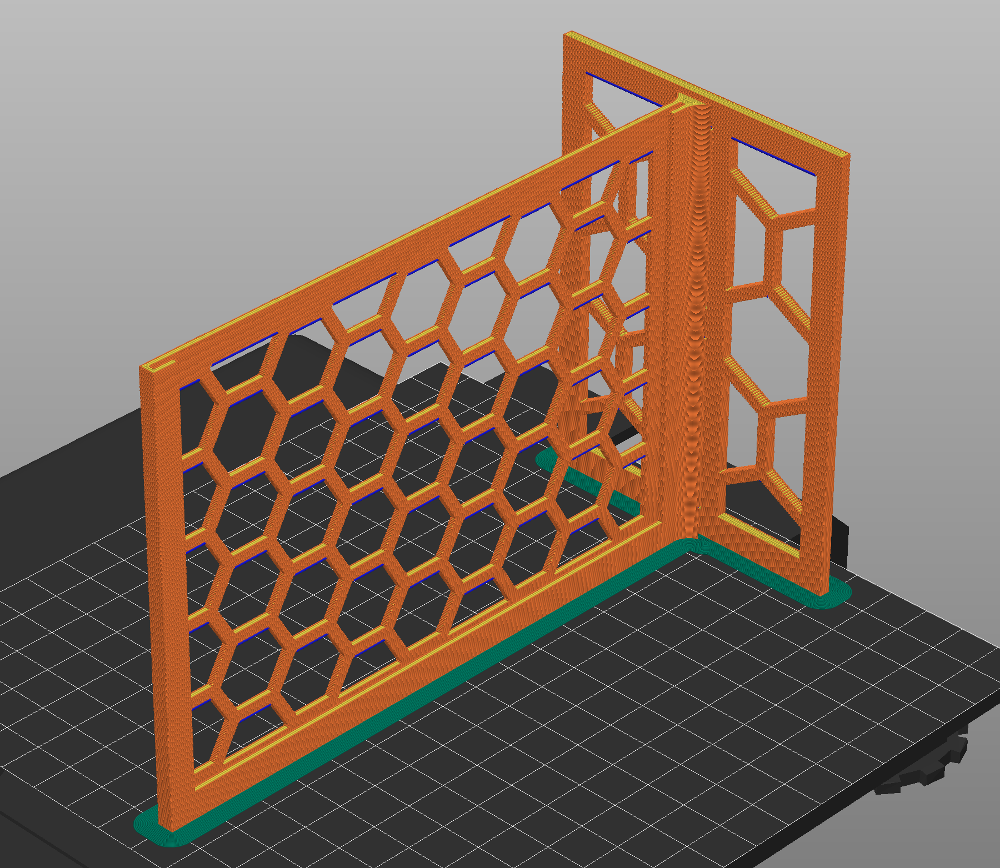

# DIN A6 Label Stand

<h3>Printing</h3>
Print lying on the side so that the opening for the paper points up. (See the photo)

Optimized for 0.6mm nozzles with 0.3mm layer height.
<ul><li>9999 perimeters (walls)</li><li>No supports</li><li>Use a brim&nbsp;</li></ul>
The two-piece set should come apart nicely for storage and transport. The single piece will be easier to print and sturdier.

