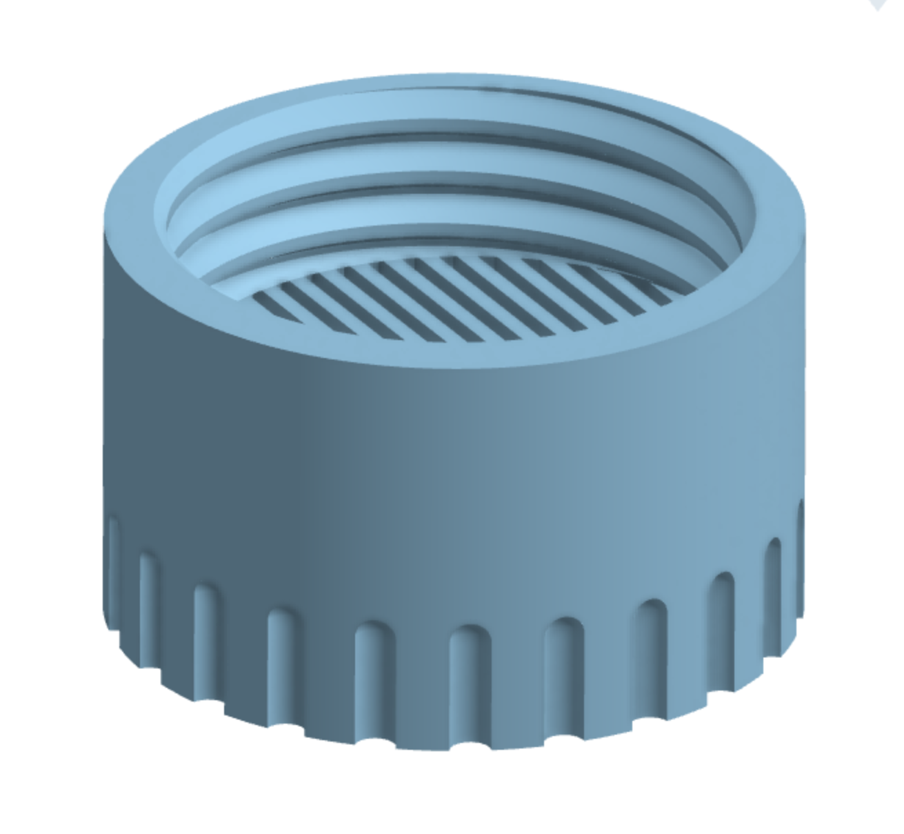

# Silica Gel Container Lid with Hygrometer - with added spacing and barrier

Each time I take out a spool of filament and forget it has one of the silica containers in it, I drop it, the hygrometer will pop out and silica gel will be spilled in each ever-so-small crevice of my floor.

This is my attempt at fixing this by adding a small barrier similar to the floor of the container between the hygrometer and the silica gel. The barrier is deliberately designed a bit weird so that slicers will create a good anchor for the bridge.
<h4>Development Notes</h4>
The original thread was hard to copy, so I tried to approximate it as good as possible:
<ul><li>Original outer diameter is ~44.87mm</li><li>Thread Angle is ~69.5° (careful, that's non-ANSI and non-ISO)</li><li>Root factor ~ 0.08431, Tip Factor ~0.271662763</li><li>Thread Pitch is: 4.27mm</li></ul>
This lid uses a 45mm x 4.27mm Thread with a 69.5° angle. I've increased the Tip Factor to 0.35 and decreased the root factor to 0.05 and added an internal offset of 0.1mm so the threads fit together nicely.

