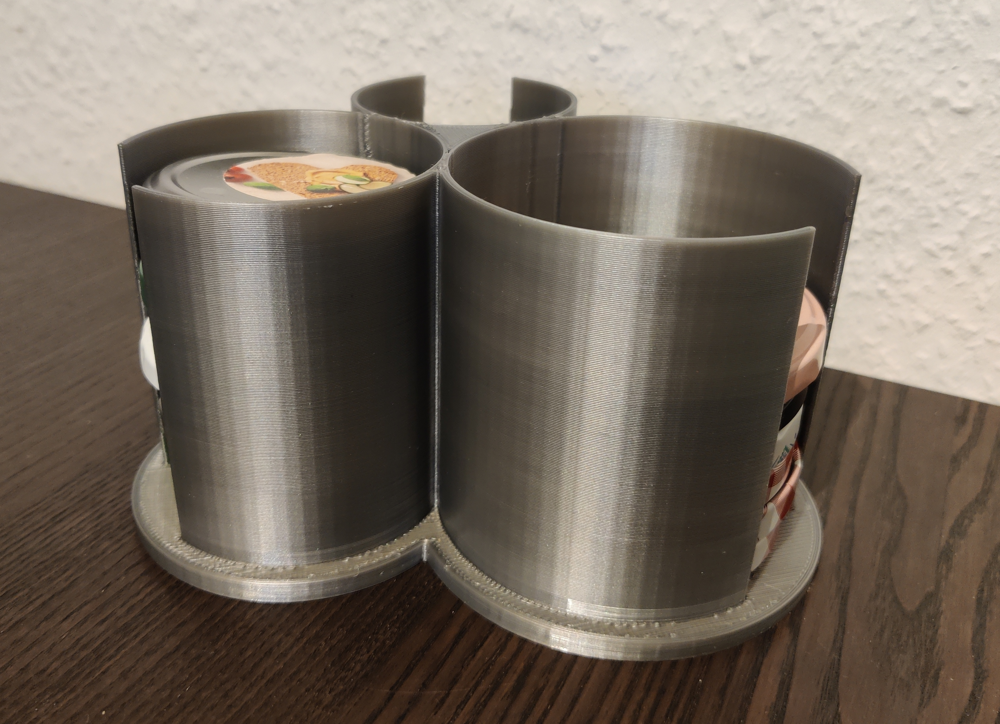

# Glass Lid Holder (Parametric Onshape Model)

This is a parametric glass lid holder. The STL is configured with 58mm, 72mm and 87mm diameter, which fits a lot of European glass lids. It can be customized with <a href="https://cad.onshape.com/documents/f3f531d5ad67c7d45c9c6ebb/w/62c690bb11dcd58103542ee3/e/e4f3566046f6b8a7190bfcb2?renderMode=0&amp;uiState=6507281d72db3c731d5d4b12">this onshape model</a>.

