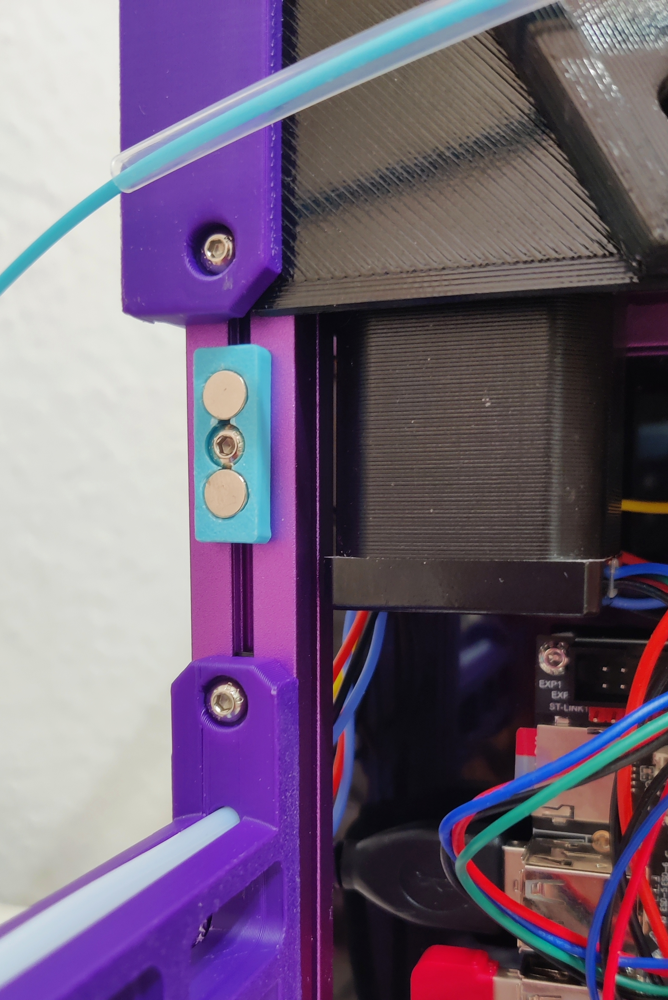
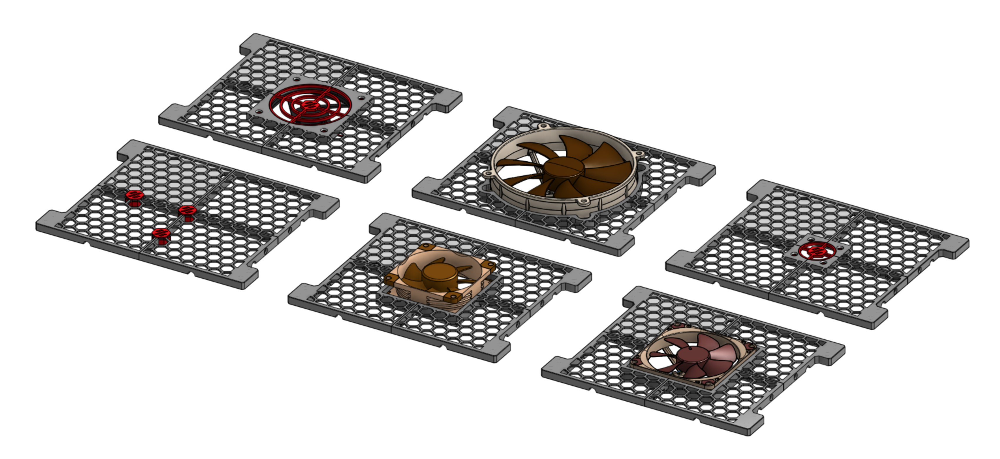

# Magnetic Backplate for Voron V0.2

This is a magnetic backplate for a Voron V0.2 that replaces only the lower rear panel. It can be printed on a voron 0.2 itself and fastens together with clamps.

Depending on your printer, some tolerances might be too tight and need some light sanding. Only the shoes require some support for clean magnet holes. Simply screw through any fan holes that are covered.
<h3>V2.2</h3><ul><li>Increased fan screw hole outer diameter to 7.4mm so fan screws sit flush</li><li>Added One Piece Models</li></ul><h3>V2.1</h3><ul><li>Added mesh templates for all backplates – print with only infill and fixate with clamps and glue</li><li>Added support for NF-PL14</li></ul><h3>V2.0</h3><ul><li>Versions for internal 4010 and 8010mm fans - easier to print and don't protrude outwards!</li><li>80mm external now comes pre-supported (just print as is and screw through the thin layer under the screwhole)</li><li>ZipTie mounting holes for fan wiring</li><li>USB cable holes on all sides</li><li>M3 Hole for additional mounts (tbd)</li><li>Completely covers the whole backpanel</li><li>Clears with URBI BTT SFS v2</li></ul>
Old shoes and clamps are compatible with V2 and can be reused.
<h3>Hardware Parts</h3><ul><li>4x M3x6 BHCS for mounting the shoes</li><li>2x M3x30 BHCS for extending the spoolholder</li><li>8/16 Magnets 6x3mm round (you can probably get away with half of them)</li><li>Optional: 80mm Fan, e.g. Noctua NF-A8 PWM, 4010 or 8010 fans</li></ul><h4>Credits for Fan Models:</h4><ul><li><a href="https://grabcad.com/library/noctua-nf-a9-14-1">https://grabcad.com/library/noctua-nf-a9-14-1</a></li><li><a href="https://grabcad.com/library/noctua-nf-a8-pwm-80x80x25-1">https://grabcad.com/library/noctua-nf-a8-pwm-80x80x25-1</a></li><li><a href="https://grabcad.com/library/nf-p14-flx-fan-1">https://grabcad.com/library/nf-p14-flx-fan-1</a></li></ul>
&nbsp;

