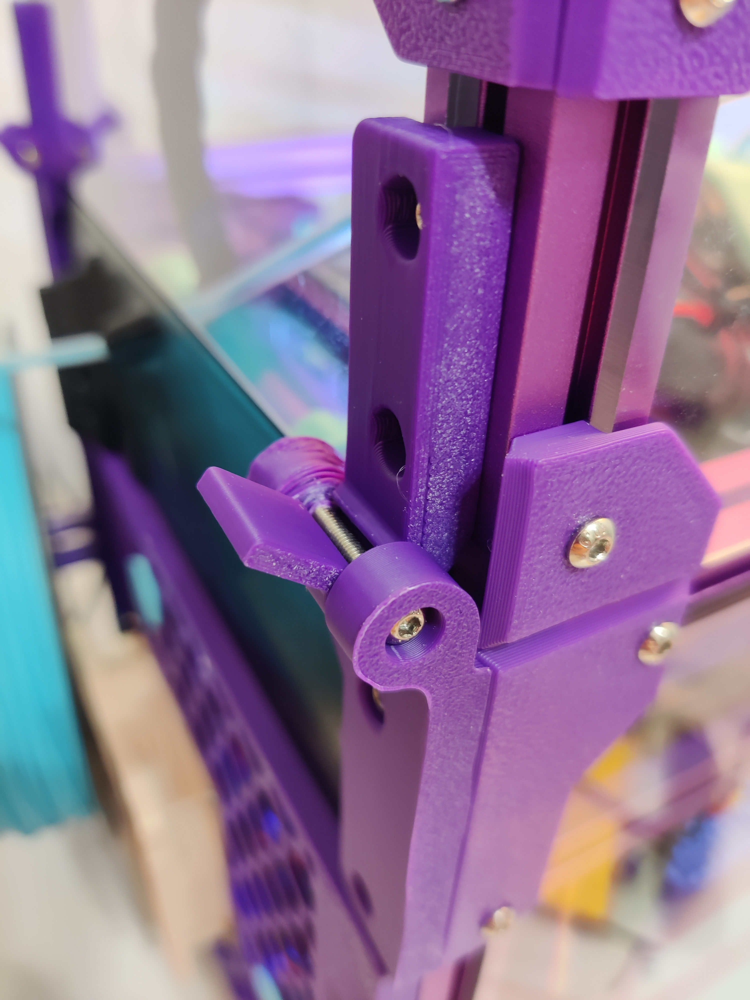
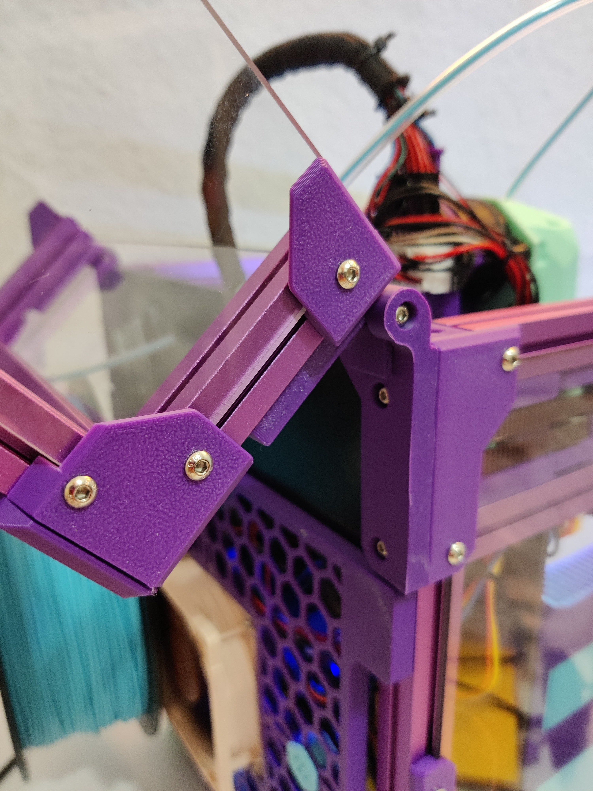

# Chirpy's V0.2 Lift-Off Tophat Hinges with Backstop

Chirpy kindly provided the STEP files for the hinge so I can make this quick adjustment. After replacing the original tophinges, the tophat will only open 125°, but can still be removed. It also prevents the tophat from falling off when you open it.

