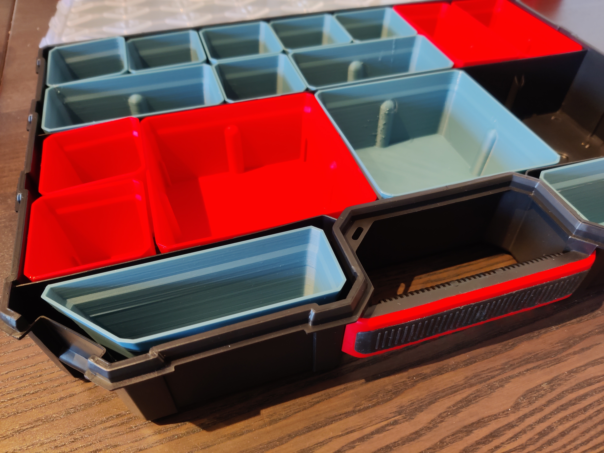
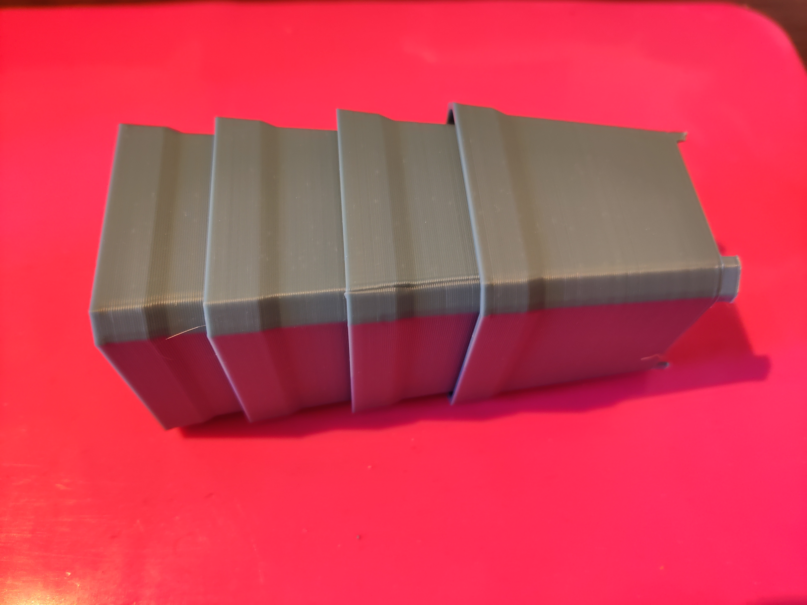
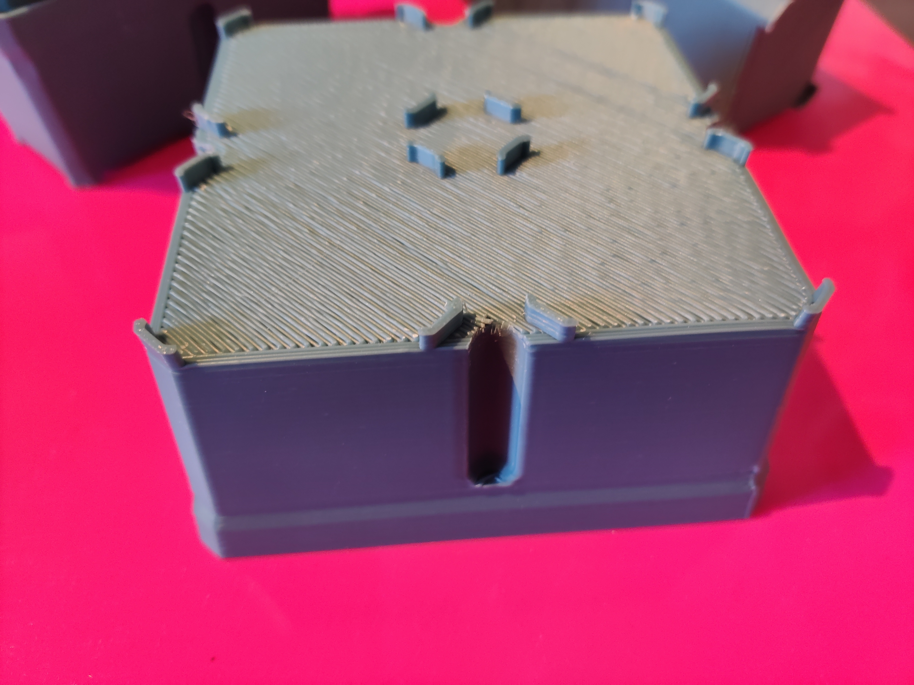

# Kistenberg Tager Organizer Boxes

Boxes that are as close to the original as possible in all sizes from 1x1 to 7x2 (ping me if you need others, those are the ones that fit without breaking the container). Additionally, adds a corner box that fills the space between the handles.
<h4>Tested with:</h4><ul><li><a href="https://www.kistenberg.com/en/organizery/tager/ktg40306b">Kistenberg KTG40306B</a></li><li><a href="https://www.kistenberg.com/en/organizery/tager/ktg60406b">Kistenberg KTG60406B</a></li><li><a href="https://www.kistenberg.com/en/organizery/tager/ktg403010b">Kistenberg KTG403010B</a></li><li><a href="https://www.kistenberg.com/en/organizery/tager/ktg604010b">Kistenberg KTG604010B</a></li></ul><h4>Printing</h4>
Print a 1x1 and a 1x2 first to see if tolerances work for you. Specifically, placing the boxes in the back row of the container can be problematic. You can also just print only the feet first to validate.

There are three versions of each box: <strong>unsupported</strong>, <strong>bridge</strong> and <strong>supported:</strong>

Print <strong>unsupported</strong> if you care about very clean undersides and want to use support yourself. Make sure the notches are supported well.

Print <strong>supported</strong> if your printer is amazing at bridging and can bridge 5cm or more well. This does not need extra support and only has tabs under the notches that can be broken away with pliers.
<h4>Changelog</h4><ul><li>V2 (2024-02-04): Increased bottom dimensions for better tolerances, added flat and angled labels and dropped bridged version</li><li>V1: Initial release</li></ul>

