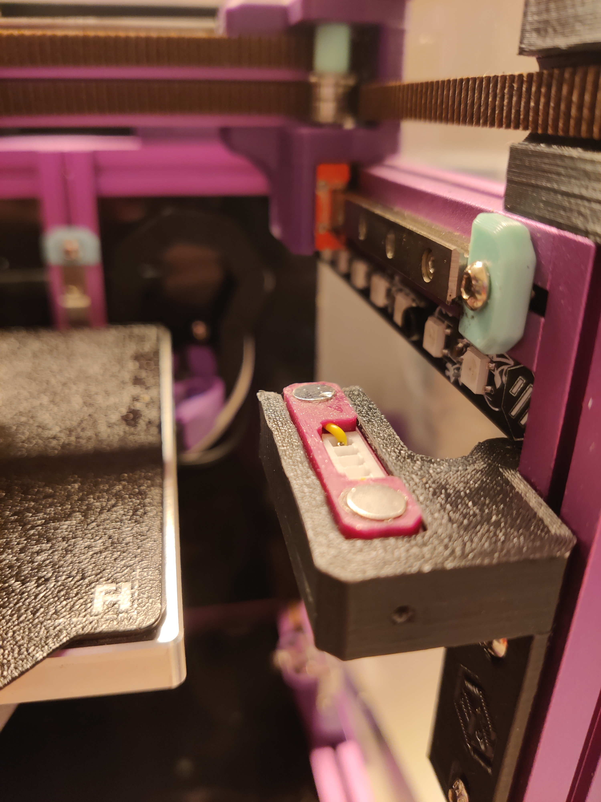
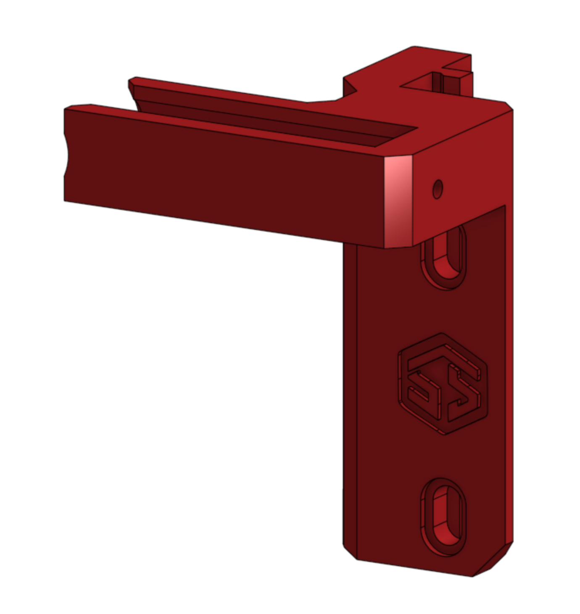

# SlideSwipe Non-Swipe Passive Mount for Voron V0.2

I recently ran into some problems with the servo and had to take it apart again. This mount temporarily serves the same function as the rotating one.

It also adds 3mm play on the mounting holes in order to make it easier to calibrate the height correctly on MakerBeamXLs where the screws tend to be hard to move once they are in the nut.

The mount will take away from your print space (roughly 10x40mm on XxY). A polygon for OrcaSlicer would be something like <code>110x0,110x40,120x40,120x0</code>

Print upside down, no supports needed.

My pickup position:
<pre><code class="language-plaintext">SS_PICKUP_POS
&gt; pickup pos X:119 Y:3 Z:20</code></pre>
Comment out the gcode for <code>SS_DEPLOY</code> and <code>SS_RETRACT,</code> and it should work like before.

