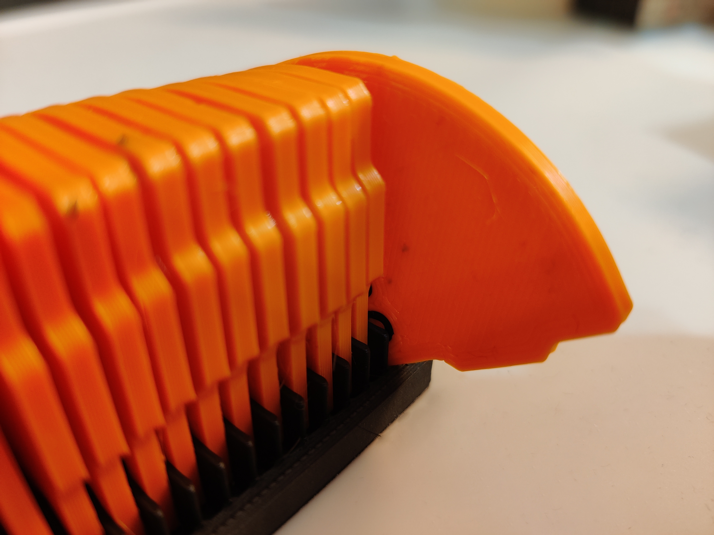
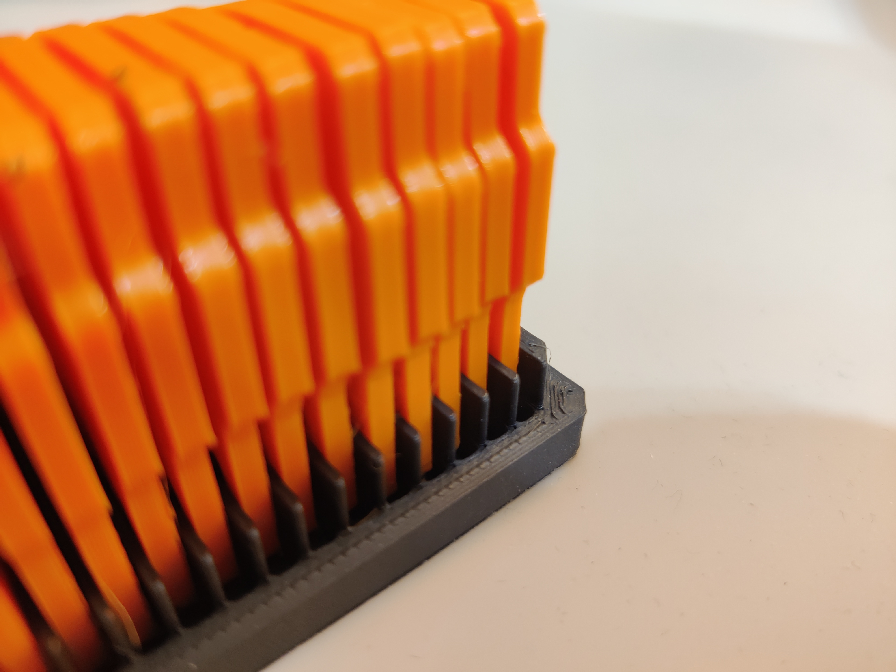
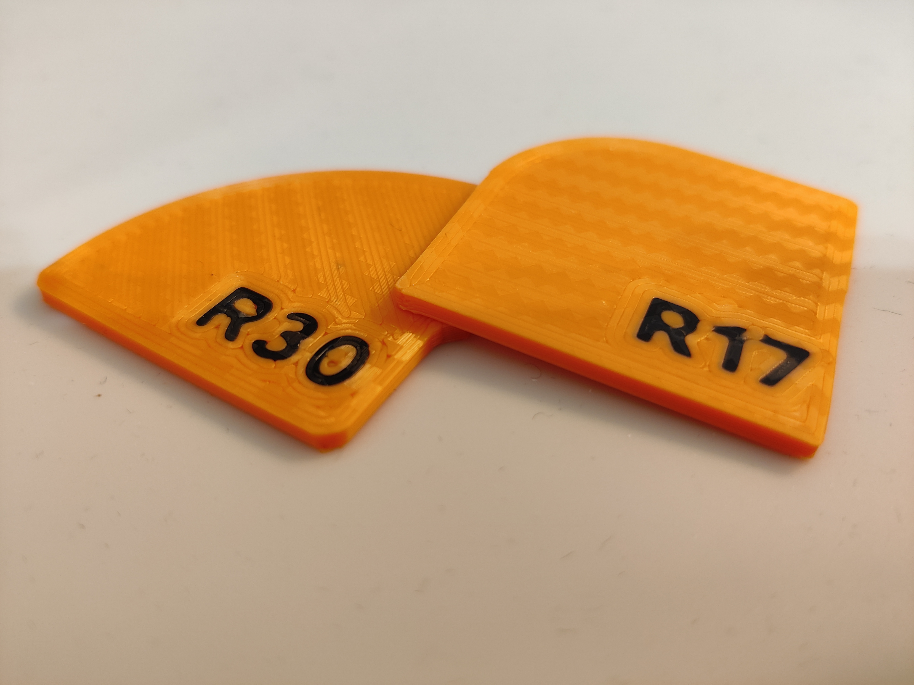
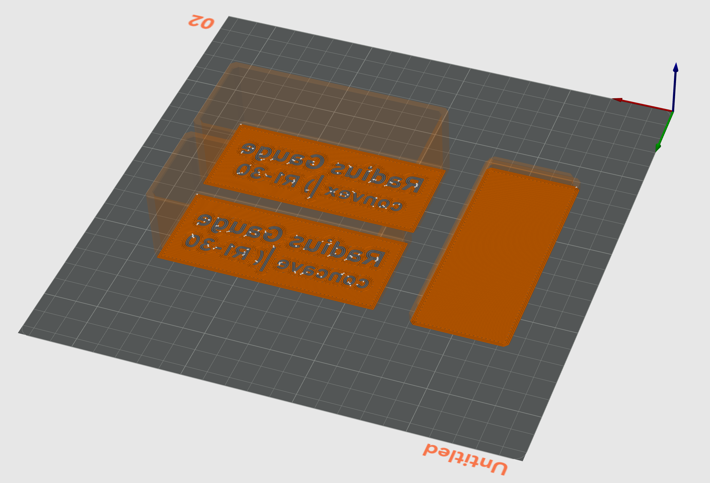

# Radius Gauge Chips R1-30mm with Single Layer Color (no AMS!)

<strong>UPDATE:</strong> There is now a “no_text” version for each style that comes without the text-object, making it easy to do a single layer swap (on Z0.3) instead.

&nbsp;

This remix uses only a single layer for the color change, making it a feasible print for single-extruder single-color printers (like mine).

The <strong>classic</strong> folder contains chips that are identical except for the font and the single layer.&nbsp;

The <strong>classic_top_concave</strong> and <strong>classic_top_convex</strong> models are compatible with the original model and only change the font to be a single layer color change.

The <strong>remix</strong> folder is over-engineering a completely fine original model by adding a <strong>tab on the side</strong> and reducing the side-length by 0.1mm for <strong>easier retrieval </strong>and <strong>rotates the text by 90° </strong>for better readability when looking for a particular radius.

The<strong> remix_bottom</strong> model over-engineers the bottom by removing one side (adding a small chamfer), making it easier to tip over a chip you want to retrieve.
<h4>Print Settings: Chips</h4><ul><li>Import only geometry and import objects as parts (in OrcaSlicer that means clicking Yes 30 times)</li><li>Change the second part for each object to the text color</li><li>9999 Top Layers</li><li>0.25/0.2mm layer height (important, the chips <strong>must not</strong> be taller than 2mm)</li><li>Manually change sequence in your slicer so that the the text is printed last (so two color changes)</li><li>Slow down your first layer by a lot (15-30mm/s max) so that the text turns out crisp</li></ul><h4>Print Settings: Box</h4><ul><li>Infill: 15% Gyroid is sufficient</li><li>Walls: 3-4</li><li>Bottom/Top: 3-4</li><li><strong>Top Parts:</strong><ul><li>Import only geometry and import objects as parts (in OrcaSlicer that means clicking Yes 30 times)</li><li>Change the second part for each object to the text color</li><li>Manually change sequence in your slicer so that the the text is printed last (so two color changes)</li><li>Slow down your first layer by a lot (15-30mm/s max) so that the text turns out crisp</li></ul></li></ul><h4>Source Code</h4>
<a href="https://github.com/reemo3dp/radius_gauge/">https://github.com/reemo3dp/radius_gauge/</a>

&nbsp;

