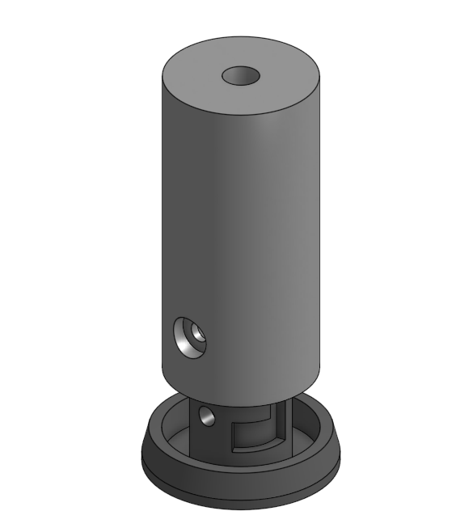
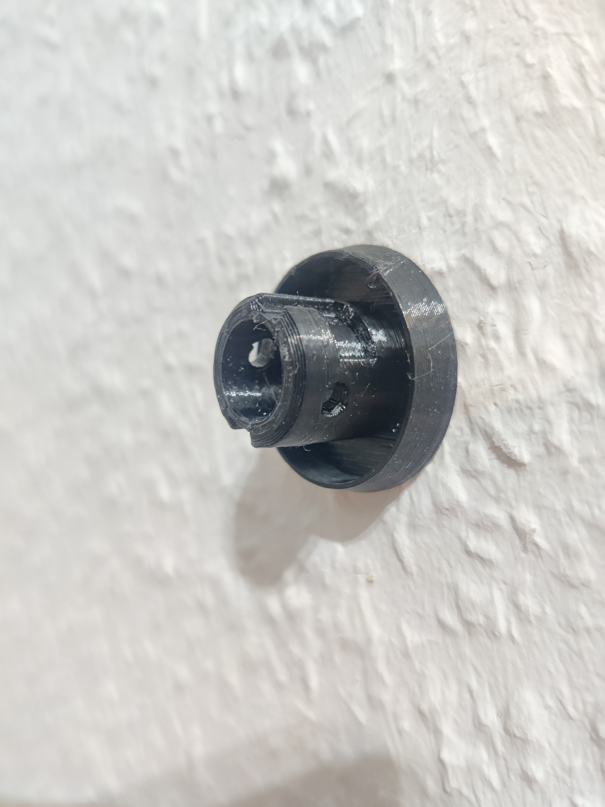
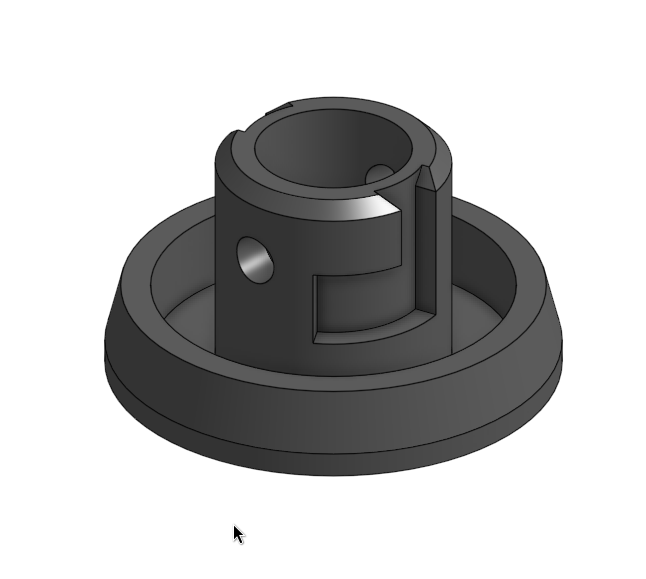

# Wall Anchor / Furniture Spacer

I needed a wall anchor bridging ~50mm that may be taken off but is fast to reattach so I came up with this:

The Base is screwed into the wall using a 3.5-4mm countersunk screw. The Spacer is mounted to the furniture piece using a M5 screw and a nyloc nut. Both pieces are screw-fit together and then locked in place using a M3 screw and a regular nut.
<h4>Required Material</h4><ul><li>M5 Screw (10mm+)</li><li>M5 Nyloc Nut</li><li>M3 Screw (20mm for the thin version, 25mm for the thicker version)</li><li>M3 nut</li></ul><h4>Print Settings</h4><ul><li>PETG, supports for the spacer pins and for the grooves on the base</li></ul><h4>Assembly</h4><ol><li>Insert the M3 nut into the side of the base</li><li>Mount the base to the wall</li><li>Prepare the spacer by inserting the nyloc nut (a screwdriver can help guide the nut). To prevent the nut from falling out, use a M5 screw and screw it on tightly before final assembly. That will force the nut to remain in place. Remove the screw.</li><li>Loosely mount the spacer to the furniture piece</li><li>Attach &amp; rotate the spacer to the base and fix it using the M3 screw</li><li>Tighten the M5 screw securing the furniture piece</li></ol>

