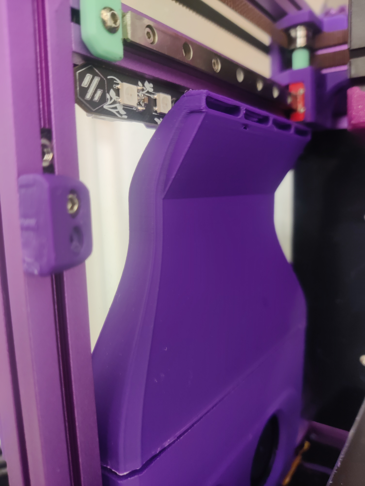
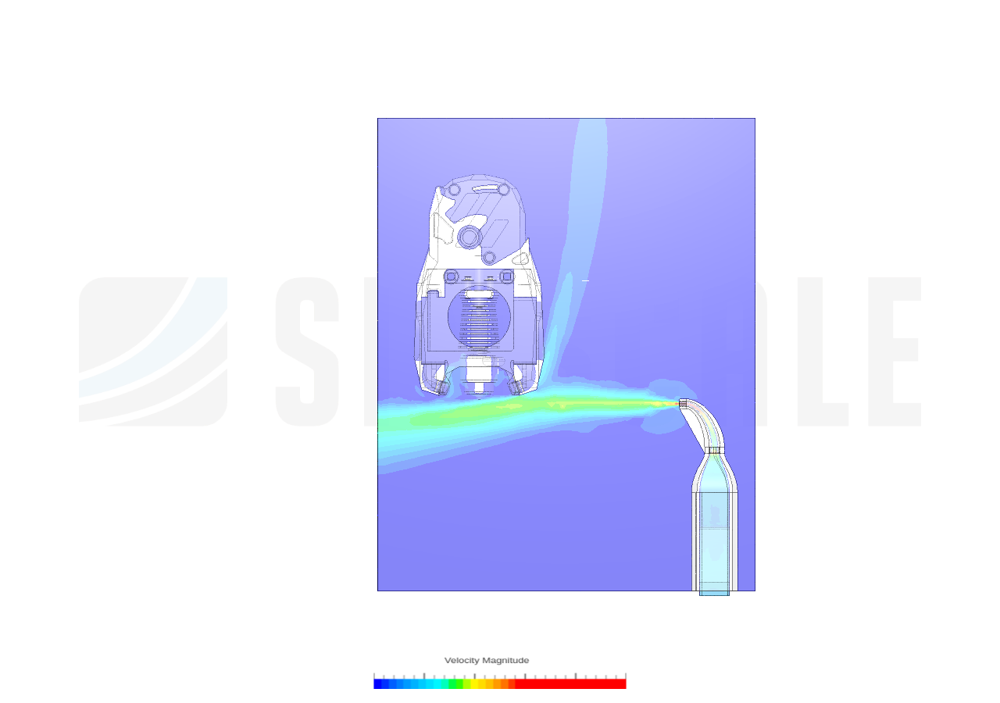
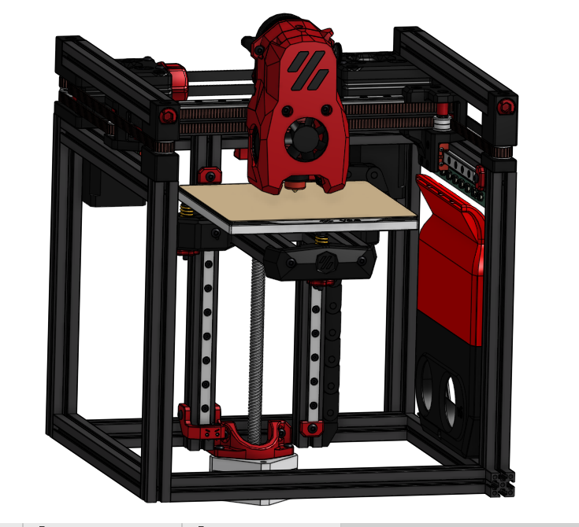

# Nevermore V6 Micro Aux Fan Duct Adapter [Proof of Concept] for Voron V0

A fanduct that can be used instead of a carbon filter cartridge on a Nevermore V6 Micro. Attaches using magnets, keeps clearance for Rainbow on a Matchstick. As the model is currently prone to warping on the floor, there's clearance for gluing TPU filament (1.75mm <strong>⌀) </strong>in the hopes that that will create a good seal.

Fits on a V0 print bed and prints up-right. CFD as per <a href="https://www.youtube.com/watch?v=Wun9EuVTV0w">TeachingTech's</a> tutorial assuming 10CFM for two GDSTime 5015 fans.

If you're printing this, I'd appreciate a comment that addresses the following:
<ul><li>Did you have warping issues? If not, what's your magic trick + filament?</li><li>What fan models do you have?</li><li>Which toolhead do you use?</li><li>Does the airflow hit the bed properly? (Bonus if you have the V0 Aux Fan for comparison)</li></ul><h3>BOM</h3><ul><li>4x 6mm<strong>⌀ </strong>x 3mm magnets</li></ul><h3>Print Settings</h3><ul><li>Material: Prefer ABS/ASA, use PETG only if necessary</li><li>To avoid warping/lift-off from the bed:<ul><li>2-3 Walls</li><li>10-15% Gyroid infill at most</li><li>Uncheck “Detect narrow internal solid infill”</li><li>Infill &amp; Bridge Directions so that the lines aren't parallel with the long side, but perpendicular</li></ul></li></ul><h4>Versions</h4><ul><li>V21 - Groove for a printed TPU seal, same CFD as V18</li><li>V18 - No groove for TPU as that's prone to cracking, but an excellent CFD</li><li>V14 - Still warps, airflow seems to be uncompromised. groove for TPU filament works well.</li><li>V13 - Untested, longer wide bottom segment to hopefully avoid warping. Might compromise airflow</li><li>V12 - Warps but works</li></ul><h4>Shout-Outs</h4>
To Pepper and GreenPlasticWateringCan for printing all the broken prototypes and to SquidMan for telling me to scrub my build plate and to ditch the glue!

