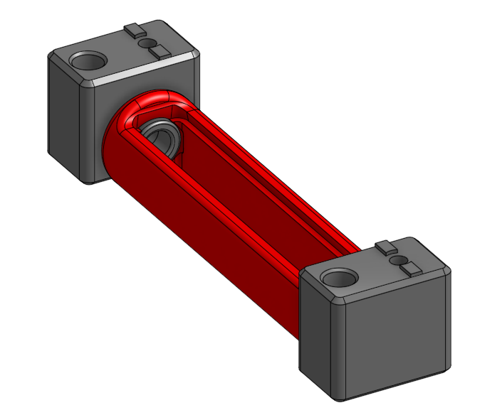
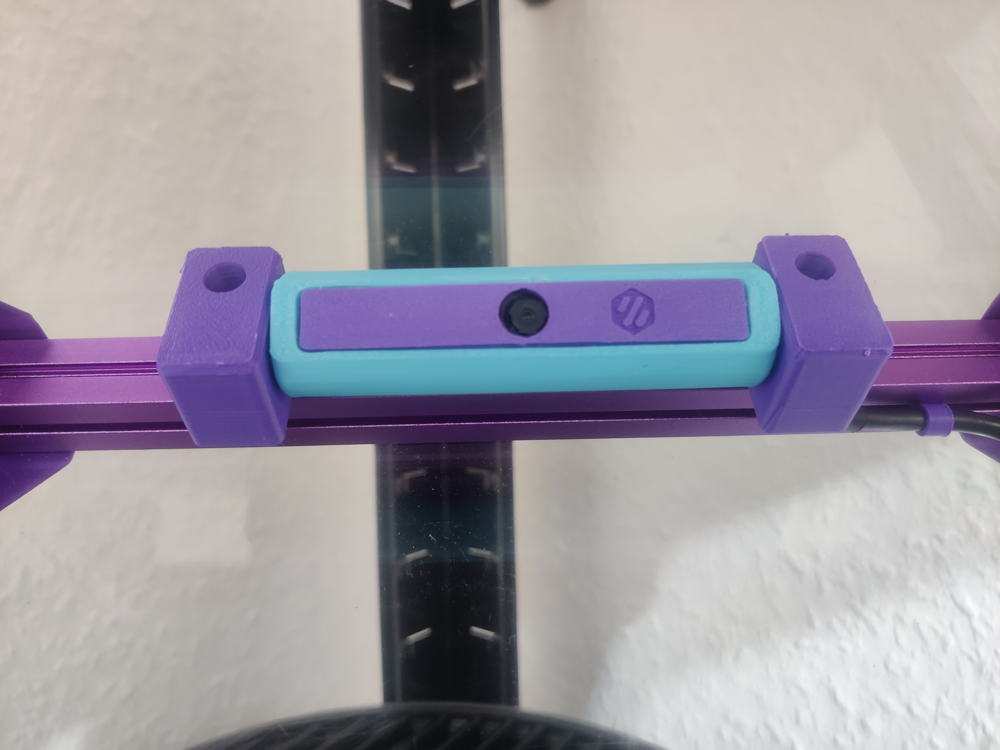

# Angry CAM 1515 V0 Extrusion Mount

Designed to mount to the horizontal top extrusion of a v0.2 tophat, this AngryCAM remix moves the screw hole and the cable path so that the USB cable can be wired across the top extrusions to the top backpanel.

