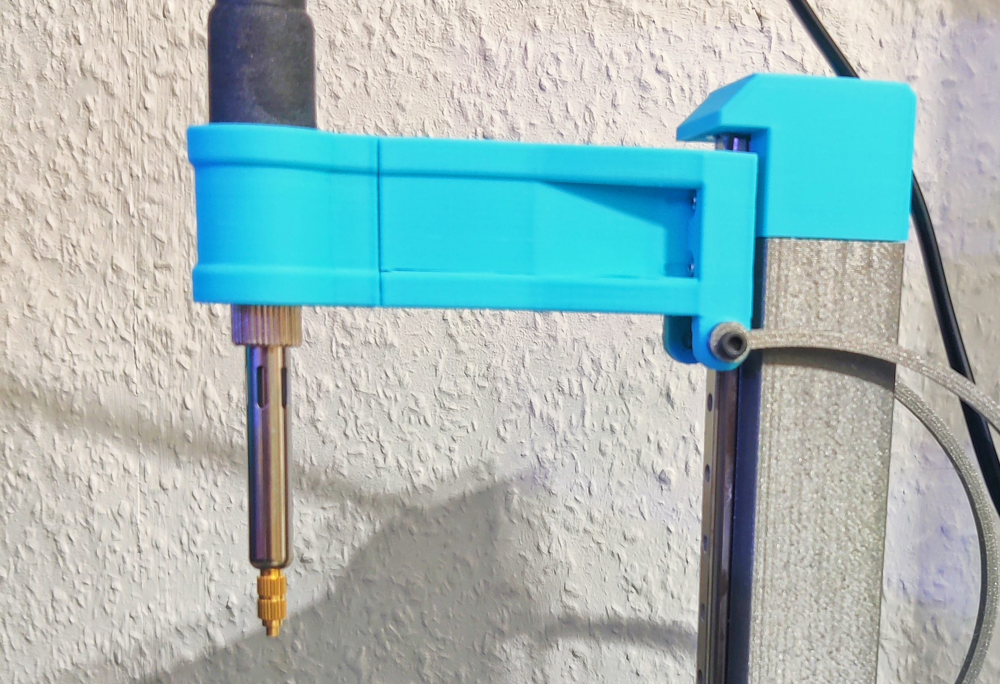
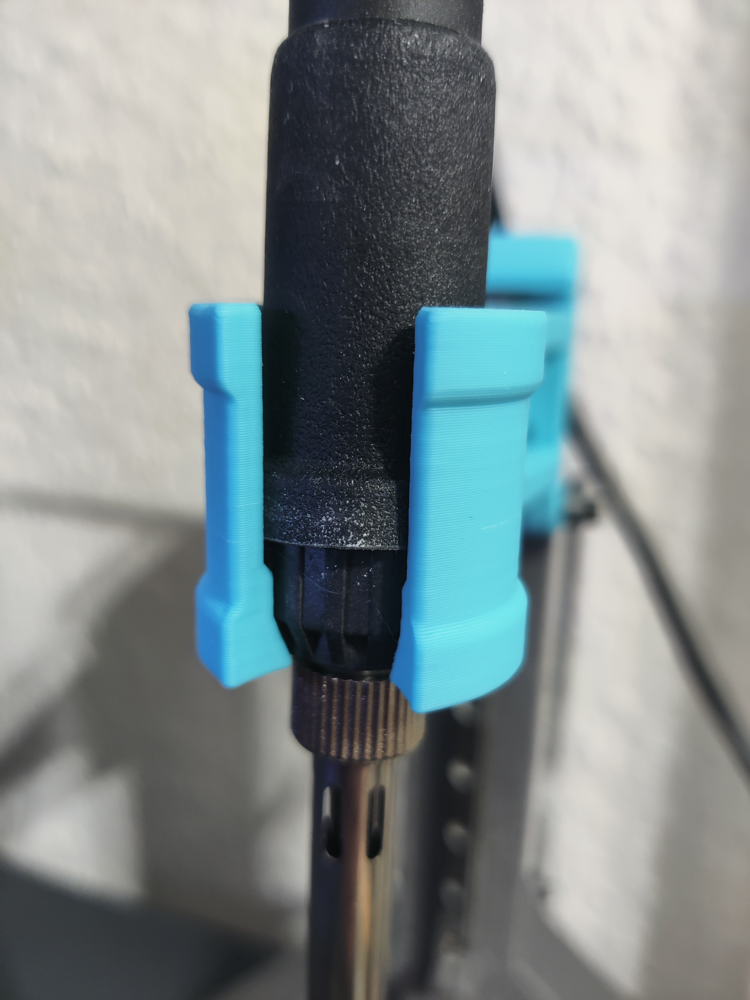
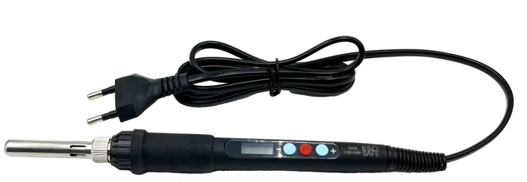

# Modular Arm + Adapters for Heat Insert Press

I printed the test parts for the original model and quickly figured that all this needed were screws so it becomes a modular adapter, removing the necessity of reprinting the whole arm when changing iron, so here's all the original arms modularized.

I further added a shaped slide-in adapter for the cheap iron I dedicated to heat inserts. I have only printed that adapter, the others are based on the original step (v1.2, holder arms v36)
<h5>BOM</h5><ul><li>2x M3x10 Counterbore</li><li>2x M3x4x5 Heat-Inserts</li></ul>

