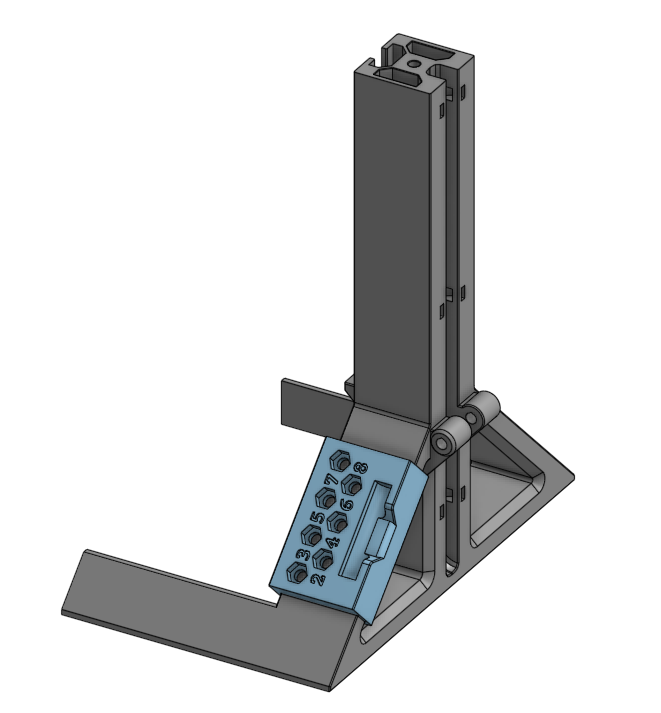

# Heat Insert Press: Clip-on for Soldering Tips

Simple storage for heat-insert adapters like <a href="https://aliexpress.com/item/1005005979413935.html">this</a>. Print standing. Different options depending on your available screws:
<h3>BOM (depending on options)</h3><ul><li>7x M4x12 or M4x10 BHCS/Countersunk</li><li>7x Hex Nut M4</li></ul>
With Hex nuts it's a bit nicer as you can tighten the screw enough so that the tips don't make it turn, but without is fine too.

