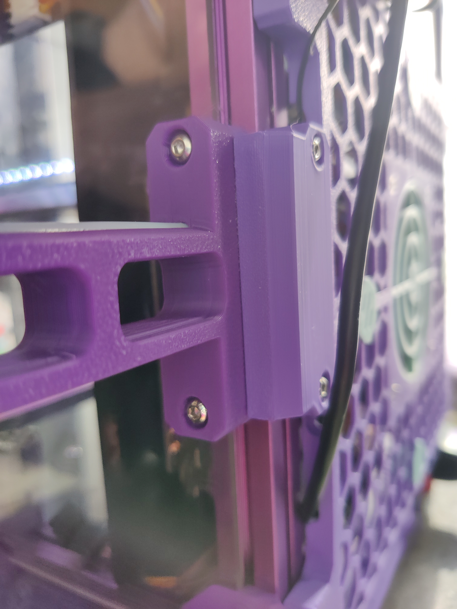
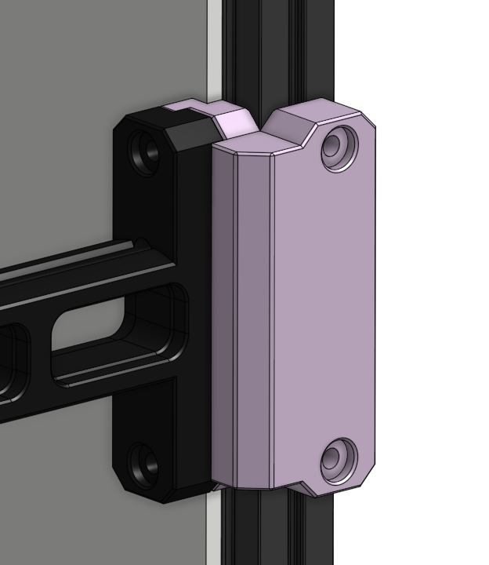

# Voron V0 Spool Holder Side Adapter

Print with support. If you don't have enough hex-nuts, replace the bottom one with a heat-insert (M3x5x4 [5mm wide, 4mm deep])

Use M3x16 screws through the spoolholder, and the original M3x10 screws for the back-side.

