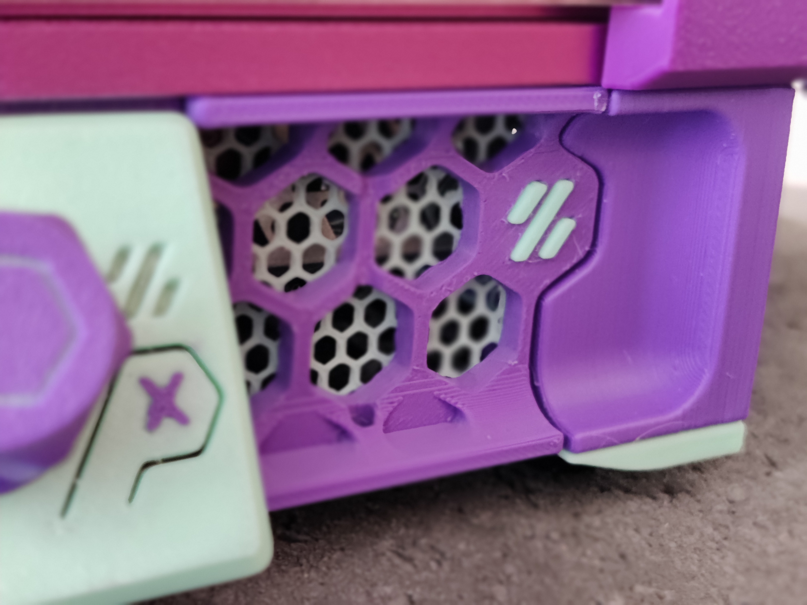
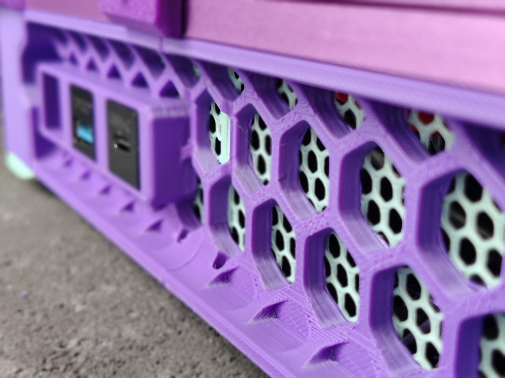
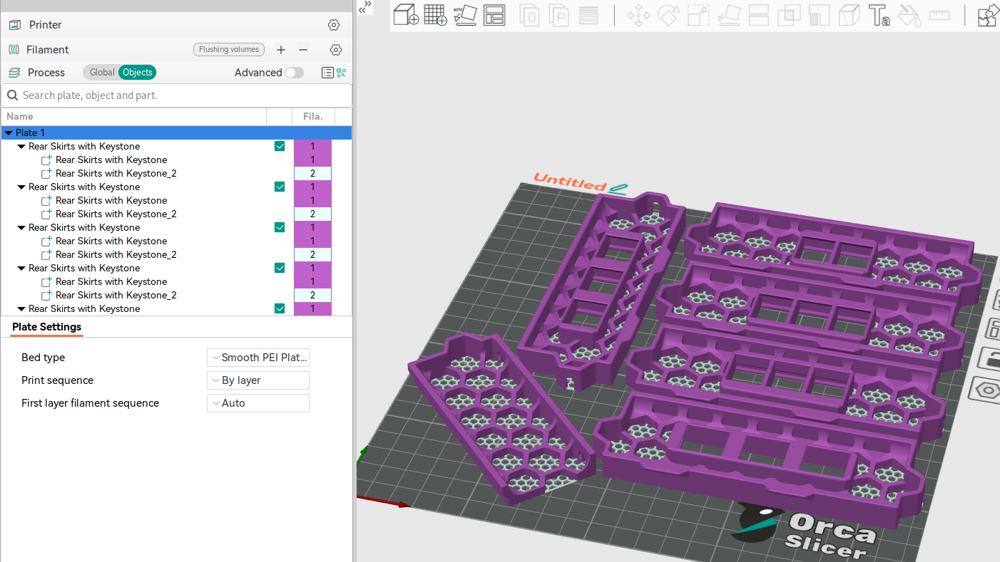

# Voron V0 Skirts with Mesh + Keystones

These skirts come with 0-3 keystones on each side, in all directions a keystone can be rotated.&nbsp;

They also come with an optional mesh that can be printed with a single filament swap. As the hex grid is prepared in the model, they will line up and don't require any manual setting besides setting different filaments in your slicer. (See the screenshot)

