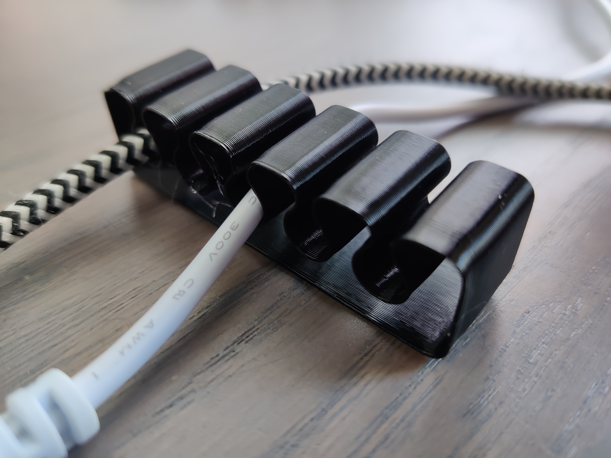
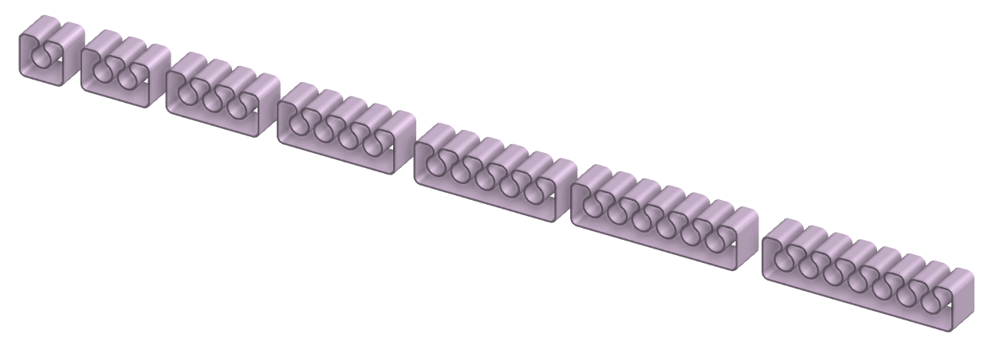

# Cable Capture Clips (Vase Mode)

Simple cable clips that can be printed in vase mode <strong>or</strong> with a thicker base and screw holes. Extrusion width should be at least 0.8mm.

Pictured is <strong>cable-capture_7d1.2o7s_x5_vase </strong>which fits single USB cables fine. I recommend the <strong>10mm 0.6mm spacing</strong> versions for a sturdy USB holder that doesn't release the cable accidentally

