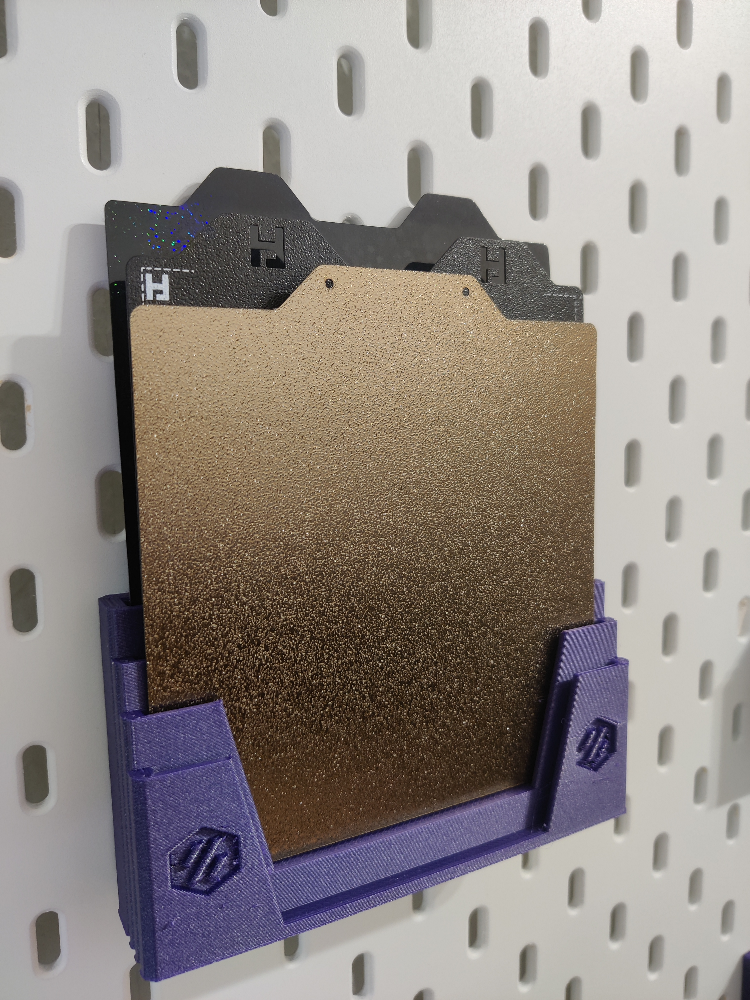
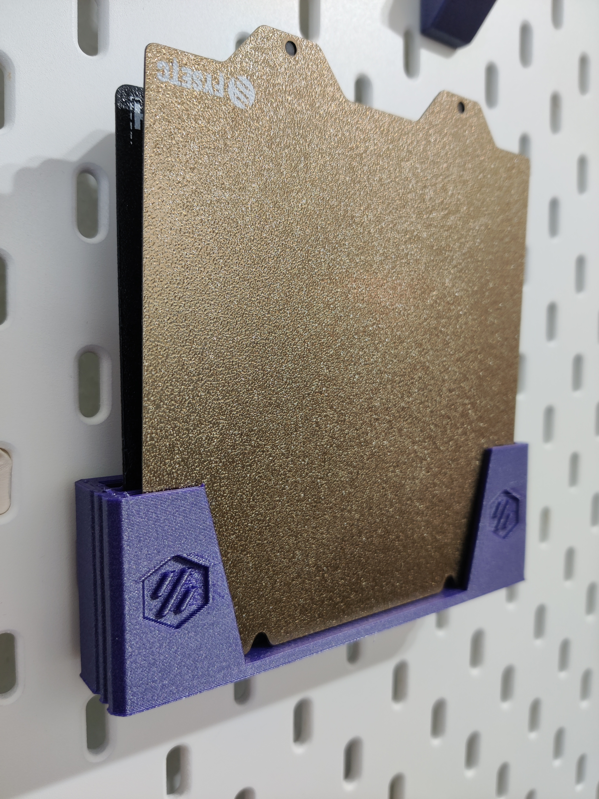

# Modular Build Place Holder

These build plate holders come in a lot of different shapes, and more can be generated using the OpenSCAD scripts available in the repository ( <a href="https://github.com/reemo3dp/build_plate_holder">https://github.com/reemo3dp/build_plate_holder</a> )&nbsp;

The SKADIS versions use the <a href="https://www.printables.com/model/183085-skadis-universal-hook-base-and-modified-hooks">SKADIS Universal Hook</a>, which is also why the slot all the way in the back will be deeper to accommodate the hook peg.
<h4>ATTENTION: <strong>I have only printed the 120mm variants.</strong></h4>
&nbsp;
<h4>Finding the right model</h4>
Printables doesn't allow me to easily batch-upload and sort files, so you will have to look for your model:

<strong>$usecase_$size_$style_$logo_$numberOfPlates.stl</strong>
<ul><li><code>$usecase ∈ standing | skadis</code> - Whether you want a standing version of the holder, or one prepared to be mounted on a SKADIS</li><li><code>$size</code> - The size of the build plates you want it to hold in millimeter. An extra margin of 2.4mm will be added to this to ensure a loose fit.</li><li><code>$size ∈ level | staircase</code> - Whether you want a level cabinet of build plates, or a podest so you can quickly spot the PEY sheet you've been meaning to use in like forever</li><li><code>$logo ∈ voron | r3d</code> - Whether you want it to have a voron logo or my very own amateurish logo</li><li><code>$numberOfPlates</code> - The number of plates it shall hold</li></ul>
These files have been uploaded from <a href="https://github.com/reemo3dp/build_plate_holder/releases/tag/20240609140236.0.0-g63c77ad-9437117727-1">https://github.com/reemo3dp/build_plate_holder/releases/tag/20240609140236.0.0-g63c77ad-9437117727-1</a>&nbsp;

